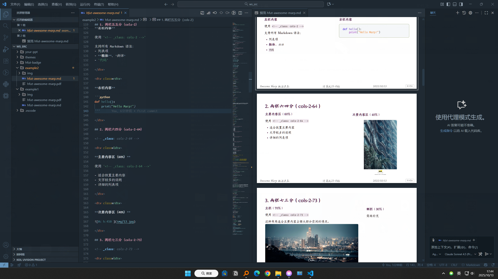
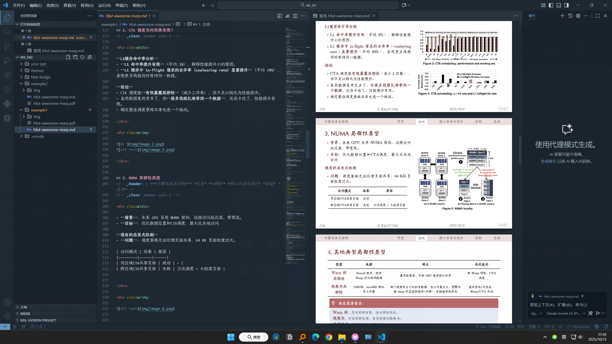
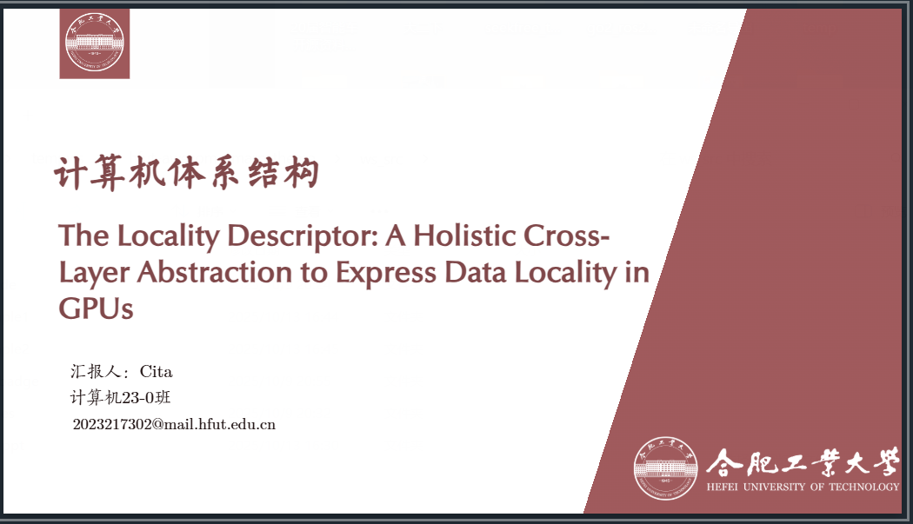
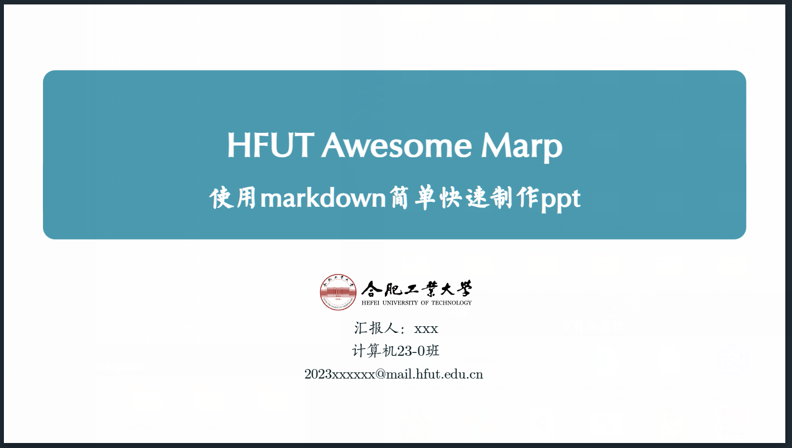
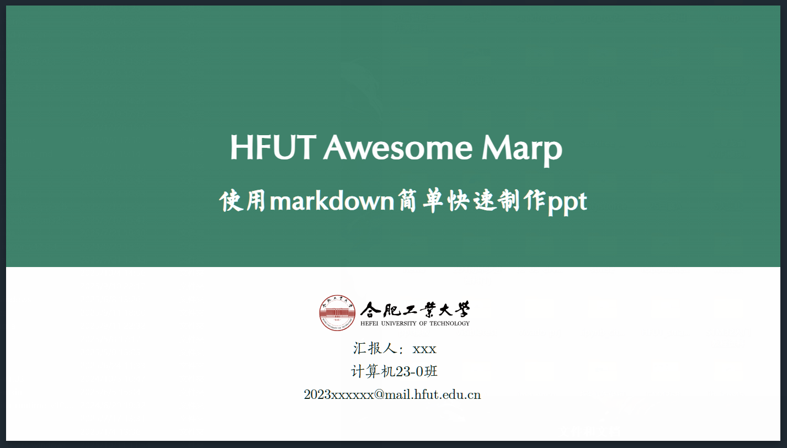
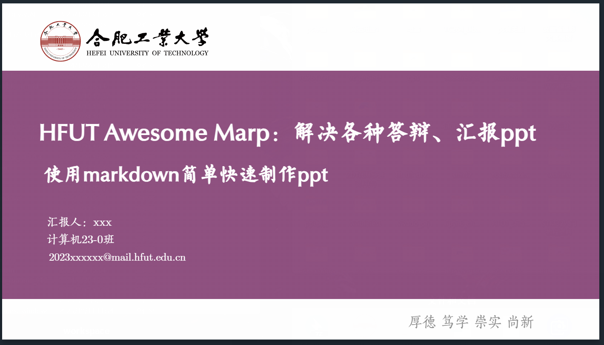
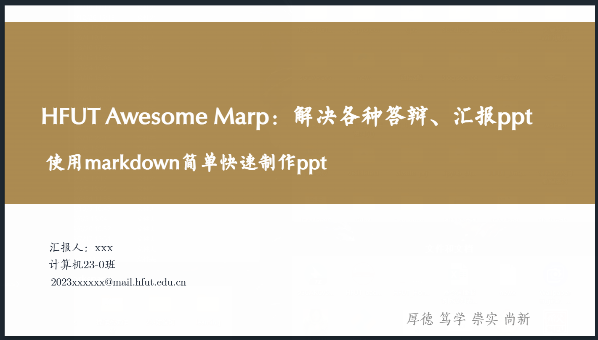
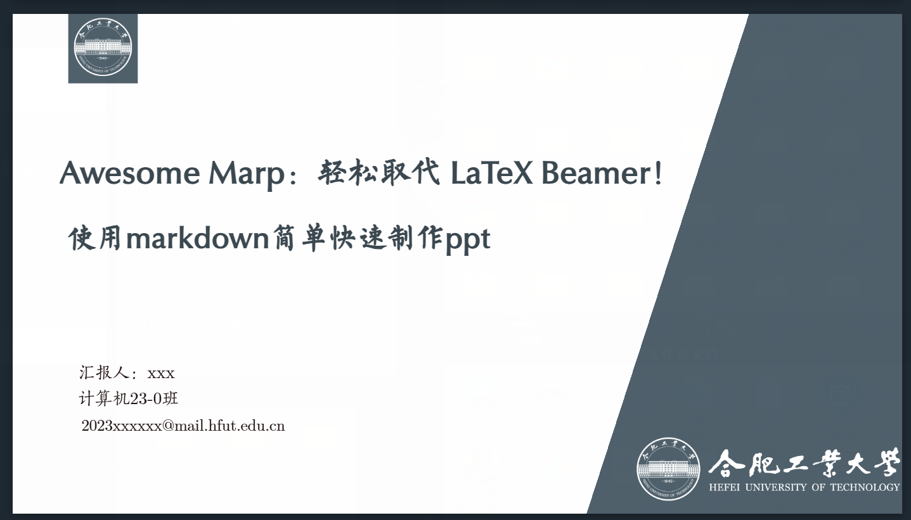

# 
# 

## HFUT Awesome Marp Theme

> 适用于合肥工业大学HFUT本科生各类答辩、课程汇报等场景的 PPT 模板。

[快速开始](#快速开始) | [主题预览](#主题预览) | [贡献指南](#贡献)

## 📄 示例预览

在现代浏览器中可以直接下载并查看以下 PDF：

- [示例 1 PDF](./assets/example1.pdf)
- [示例 2 PDF](./assets/example2.pdf)

## ✨ 特性

- ✅ **多主题**：内置多种主题色（紫、红、蓝、绿、棕、暗）
- ✅ **多布局**：提供封面、目录、内容页等多种布局
- ✅ **易于使用**：基于 Markdown，专注于内容创作
- ✅ **HFUT 元素**：集成校徽、校名等视觉元素
- ✅ **开箱即用**：提供完整模板，快速上手





## 主题预览

| 主题色 |                     预览图                     |
| :----: | :--------------------------------------------: |
|  红色  |        |
|  蓝色  |      |
|  绿色  |    |
|  紫色  |  |
|  棕色  |    |
|  暗色  |      |

*更多使用细节，请参考 `ws_src` 目录下的`example2`示例文件。*

## 快速开始

### 所需工具

#### Markdown 编辑器

推荐使用以下两种编辑器之一：

- **VS Code**：[下载地址](https://code.visualstudio.com/)
- **Obsidian**：[下载地址](https://obsidian.md/)

#### 插件安装

- **VS Code 用户**：安装 [Marp for VS Code](https://marketplace.visualstudio.com/items?itemName=marp-team.marp-vscode) 插件
- **Obsidian 用户**：安装 [Marp Slides](https://github.com/samuele-cozzi/obsidian-marp-slides) 插件

#### 字体（可选但推荐）

为获得最佳显示效果，建议安装以下字体：

- **正文字体**：Latin Modern Math、方正宋刻本秀楷简体（未安装时默认使用 Calibri 和楷体）
- **标题字体**：Optima LT Medium、方正苏新诗柳楷简体（未安装时默认使用 Arial 和黑体）
- **脚注字体**：Charm、叶根友毛笔行书修正版（未安装时默认使用 Calibri 和楷体）
- **代码字体**：Fira Code、霞鹜文楷等宽（未安装时默认使用 Consolas 和华文中宋）

> 📥 [字体文件打包下载(仅供体验，体验后自行删除)](https://github.com/cita-777/hfut-awesome-marp-theme/releases)

### 准备工作

#### 方式一：克隆仓库（推荐）

在终端中执行以下命令：

```bash
git clone https://github.com/yourusername/hfut-awesome-marp-theme.git
```

或者先 Fork 本仓库到自己的 GitHub，再克隆自己的仓库。

#### 方式二：直接下载

点击仓库页面的 `Code` → `Download ZIP`，下载后解压到本地。

### 使用方法

#### VS Code 用户

1. 使用 VS Code 打开 `ws_src` 文件夹（确保已安装 Marp for VS Code 插件）

2. 打开示例文件：`example1/hfut-awesome-marp.md` 或 `example2/hfut-awesome-marp.md`

3. 打开预览：
   - 点击编辑器右上角的预览图标
   - 或使用快捷键：`Ctrl+K` 然后按 `V`

4. 在你的 Markdown 文件头部选择主题：

   ```yaml
   ---
   marp: true
   theme: am_red  # 可选：am_red, am_blue, am_green, am_purple, am_brown, am_dark
   ---
   ```

5. 开始编写内容，预览会实时更新

#### Obsidian 用户

1. 在 Obsidian 中打开 `ws_src` 文件夹作为仓库

2. 安装并启用 Marp Slides 插件

3. 配置插件设置：
   - 打开 Obsidian 设置 → 第三方插件 → Marp Slides
   - 设置 **CSS 路径**为：`themes`（相对于仓库根目录）
   - 确保 **Enable Marp** 选项已开启

4. 打开示例文件：`example1/hfut-awesome-marp.md`

5. 在文件头部添加主题配置：

   ```yaml
   ---
   marp: true
   theme: am_red  # 可选：am_red, am_blue, am_green, am_purple, am_brown, am_dark
   ---
   ```

6. 使用命令面板（`Ctrl+P`）执行 `Marp: Export slide deck` 导出演示文稿

#### 创建你的演示文稿

在 `ws_src/your-ppt` 文件夹中创建你自己的 Markdown 文件和 `img` 文件夹，开始制作专属演示文稿！

`ws_src`将是你的工作区，你也可以不断建立新的ppt工程文件夹！

Enjoy！当你用它做了两三个ppt后你的制作速度会飞速提升，别忘了大部分AI最擅长输出的就是MarkDown这一特点！
喜欢的话点个Star⭐！

## 贡献

欢迎贡献！如果你发现 Bug 或想丰富主题，请通过以下方式参与：

### 报告问题

如果你发现 Bug 或有改进建议，请通过 [Issues](https://github.com/yourusername/hfut-awesome-marp-theme/issues) 提交。

### 提交代码

1. Fork 本仓库
2. 创建一个新的分支（`git checkout -b feature/your-feature`）
3. 提交你的更改（`git commit -m 'feat: Add some feature'`）
4. 推送到你的分支（`git push origin feature/your-feature`）
5. 创建一个新的 Pull Request

在提交之前，请确保你的更改在本地测试通过。

## 📄 许可

本项目基于 [MIT](./LICENSE) 许可。

## 🙏 鸣谢

本项目使用或参考了以下优秀开源项目的资源：

- **[Awesome-Marp](https://github.com/favourhong/Awesome-Marp)**：提供了本项目主题设计的基础和灵感
- **[Marp](https://marp.app/)**：驱动本项目的核心演示文稿工具
- **[HFUTTUG/HFUT-badge: 合肥工业大学(Hefei University of Technology)校徽/校标 | Hefei University of Technology(HFUT) badge/logo.](https://github.com/HFUTTUG/HFUT-badge)：svg版本校徽/校标的使用**

感谢上述项目！

