<div align="center">


# HFUT Awesome Marp Theme

**以人类与 AI 都擅长的 Markdown 为中间媒介语言，与 AI 协助写出高颜值答辩 & 汇报 PPT**

适用于合肥工业大学 (HFUT) 各类答辩、课程汇报、学术分享等场景

[](./LICENSE)
[](https://marp.app/)
[](https://github.com/cita-777/hfut-awesome-marp-theme)

[预览](#-预览) · [快速开始](#-快速开始) · [配套 Skill](#-配套-skill) · [贡献指南](#-贡献)

</div>

---

## 📸 预览

### 示例效果

<table>
  <tr>
    <td align="center">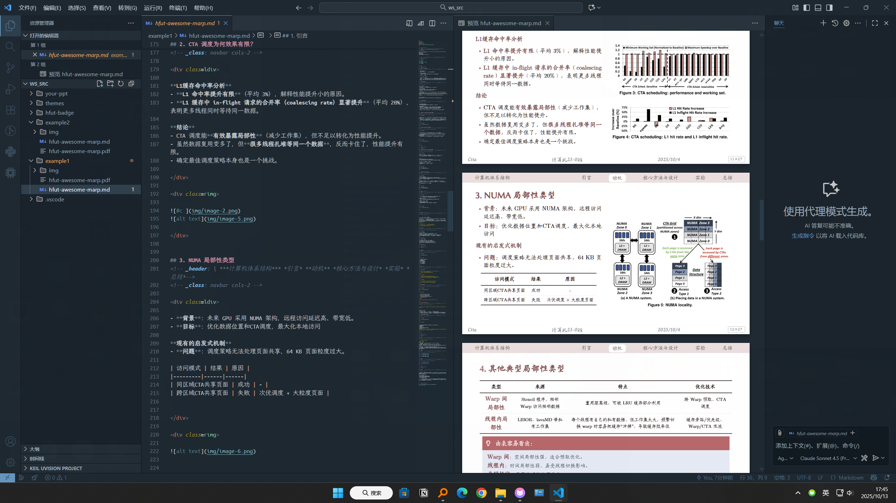<br><b>示例 1</b>｜example1</td>
    <td align="center">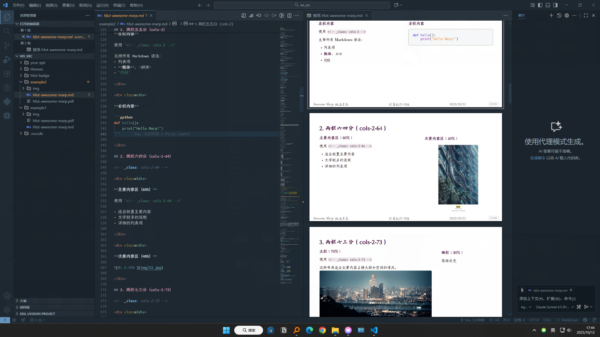<br><b>示例 2</b>｜example2</td>
  </tr>
  <tr>
    <td align="center">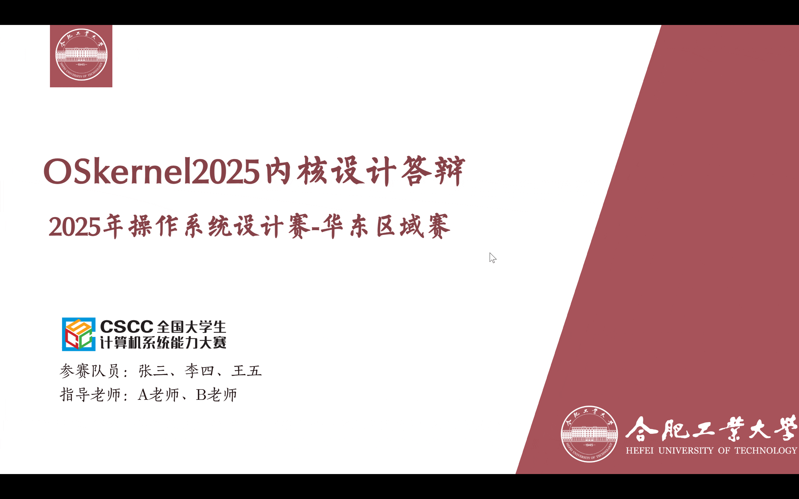<br><b>示例 3</b>｜example3</td>
    <td align="center">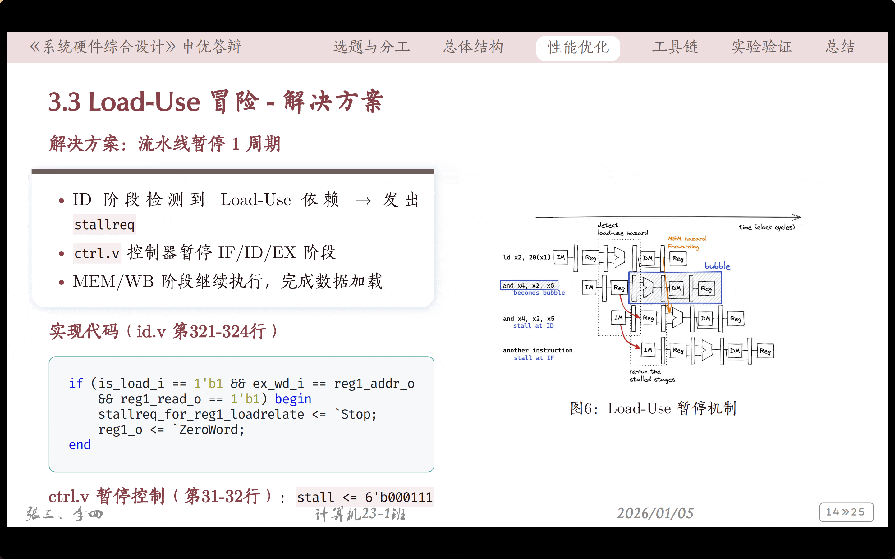<br><b>示例 4</b>｜example4</td>
  </tr>
  <tr>
    <td align="center">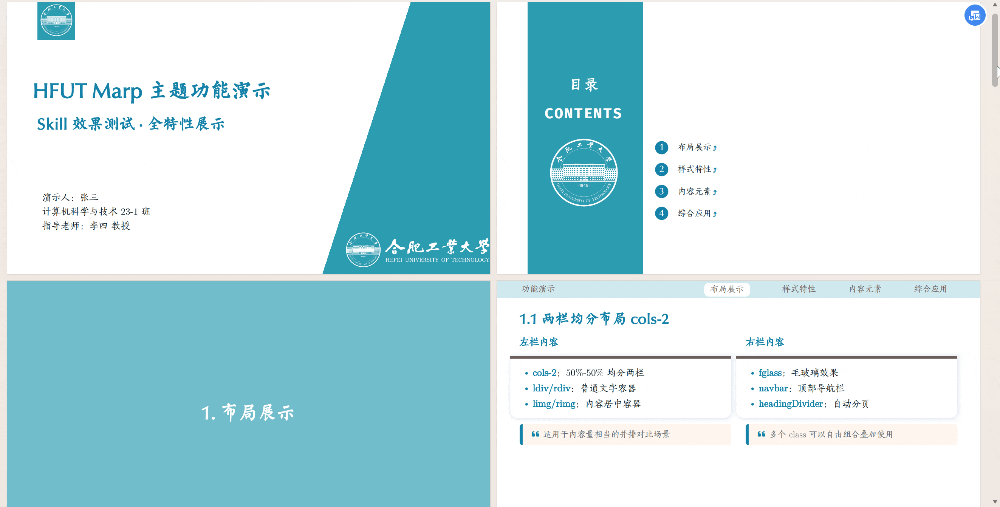<br><b>示例 5</b>｜Claude Opus 4.6 直出 demo1</td>
    <td align="center">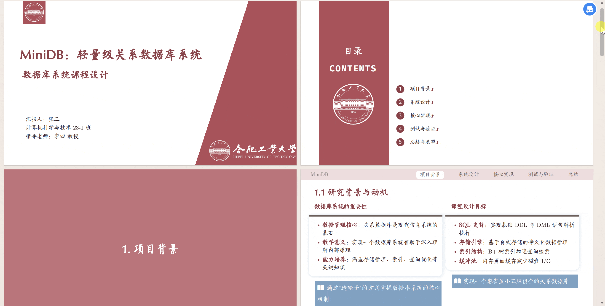<br><b>示例 6</b>｜Claude Opus 4.6 直出 demo2</td>
  </tr>
</table>

> 📥 直接下载查看：[示例 1 PDF](./assets/example1.pdf) ｜ [示例 2 PDF](./assets/example2.pdf) ｜ [示例 3 PPTX](./assets/example3.pptx) ｜ [示例 4 PDF](./assets/example4.pdf) ｜ [Demo1 PDF](./assets/demo1-feature.pdf) ｜ [Demo2 PDF](./assets/demo2-minidb.pdf)

### 主题色一览

|            红色 `am_red`            |           蓝色 `am_blue`           |          绿色 `am_green`          |
| :------------------------------------: | :----------------------------------: | :----------------------------------: |
|    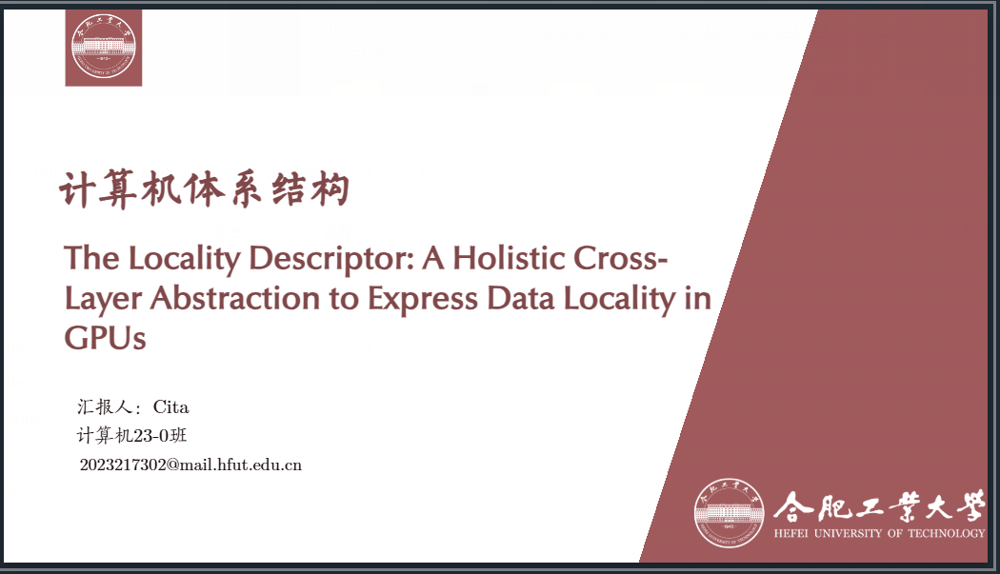    |  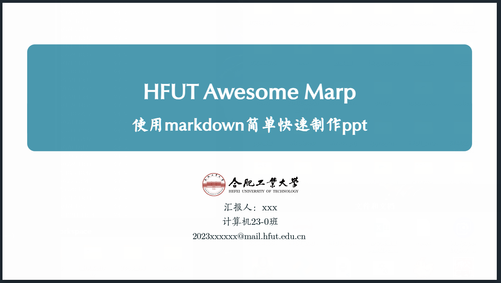  | 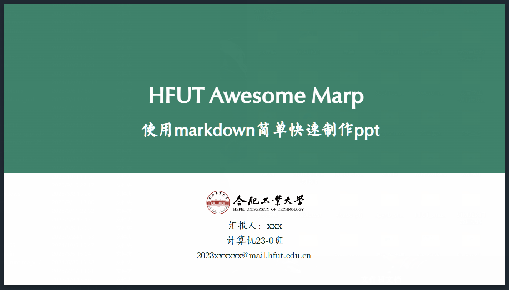 |
|      **紫色 `am_purple`**      |     **棕色 `am_brown`**     |      **暗色 `am_dark`**      |
| 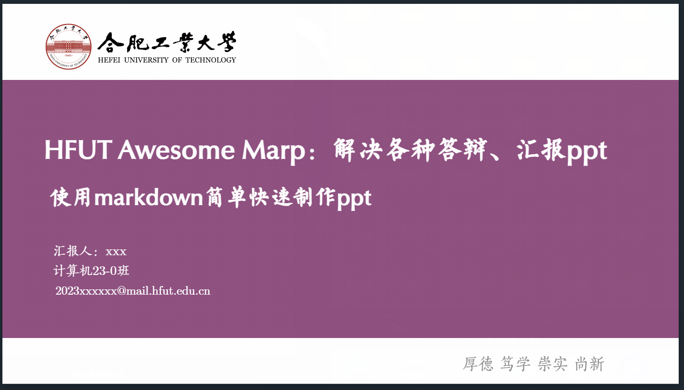 | 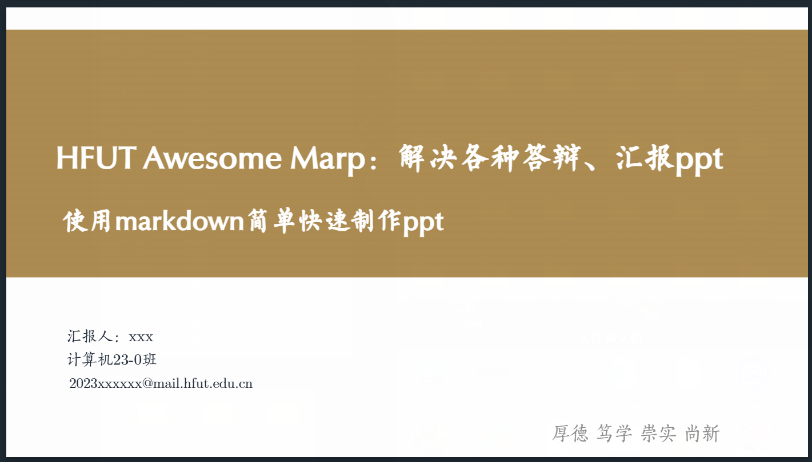 |  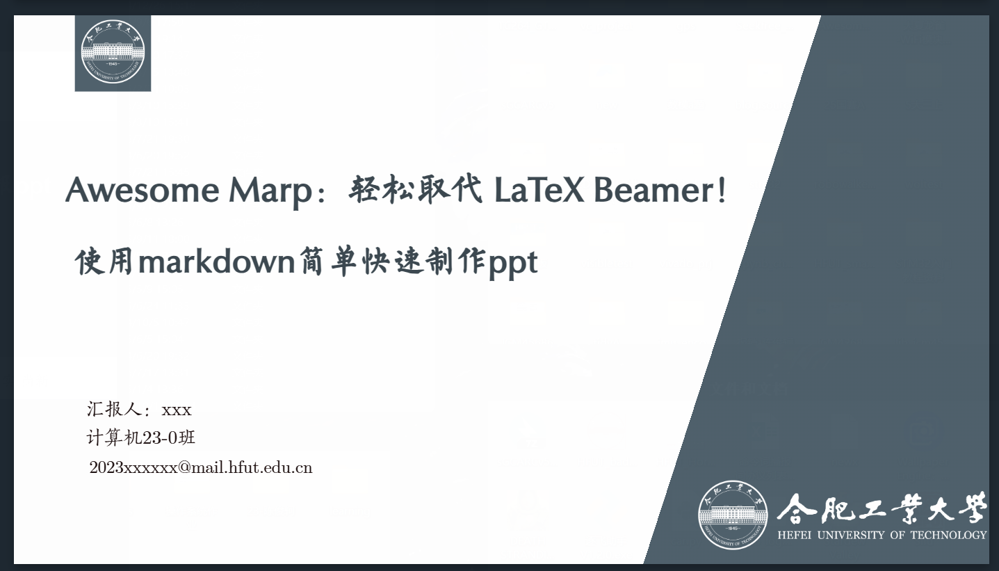  |

> 更多使用细节见 `ws_src/example2/` 示例文件。

## ✨ 特性

|      | 特性                    | 说明                                         |
| :--: | ----------------------- | -------------------------------------------- |
|  🎨  | **六套主题色**    | 红、蓝、绿、紫、棕、暗——一行 YAML 切换     |
|  📐  | **丰富布局**      | 封面 × 5、目录 × 2、分栏、品字型、导航栏… |
| ✍️ | **Markdown 驱动** | 专注内容创作，告别鼠标拖拽                   |
|  🏫  | **HFUT 元素**     | 校徽、校名 SVG 内置，开箱即用                |
|  🤖  | **AI 加持**       | 内置 AI Skill，一句话生成完整 PPT            |
|  🔤  | **精选字体**      | 中英文字体搭配，学术感拉满                   |

## 🚀 快速开始

### 1. 安装工具

<table>
  <tr>
    <th>编辑器（二选一）</th>
    <th>所需插件</th>
  </tr>
  <tr>
    <td><a href="https://code.visualstudio.com/">VS Code</a>（推荐）</td>
    <td><a href="https://marketplace.visualstudio.com/items?itemName=marp-team.marp-vscode">Marp for VS Code</a></td>
  </tr>
  <tr>
    <td><a href="https://obsidian.md/">Obsidian</a></td>
    <td><a href="https://github.com/samuele-cozzi/obsidian-marp-slides">Marp Slides</a></td>
  </tr>
</table>

### 2. 获取模板

```bash
# 方式一：克隆仓库（推荐）
git clone https://github.com/cita-777/hfut-awesome-marp-theme.git

# 方式二：下载 ZIP
# 仓库页面 → Code → Download ZIP
```

### 3. 开始使用

<details>
<summary><b>📘 VS Code 用户</b></summary>

1. 用 VS Code 打开 `ws_src` 文件夹
2. 打开任意示例文件（如 `example1/hfut-awesome-marp.md`）
3. 按 `Ctrl+K V` 打开侧边预览（或点击编辑器右上角的 Marp 预览图标）
4. 在文件头部设置主题：

   ```yaml
   ---
   marp: true
   theme: am_red  # 可选：am_red, am_blue, am_green, am_purple, am_brown, am_dark
   paginate: true
   headingDivider: [2,3]
   ---
   ```
5. 编写内容，预览实时更新 ✨

</details>

<details>
<summary><b>📗 Obsidian 用户</b></summary>

1. 在 Obsidian 中打开 `ws_src` 文件夹作为仓库
2. 安装并启用 **Marp Slides** 插件
3. 插件设置中将 **CSS 路径** 设为 `themes`
4. 打开示例文件，在文件头部配置主题（同上）
5. 使用命令面板 `Ctrl+P` → `Marp: Export slide deck` 导出

</details>

### 4. 创建你的 PPT

在 `ws_src/` 下新建文件夹，开始你的创作：

```
ws_src/
├── your-ppt/                ← 你的 PPT 工程
│   ├── hfut-awesome-marp.md ← Markdown 文件
│   └── img/                 ← 图片资源
├── themes/                  ← 主题 CSS（无需修改）
└── hfut-badge/              ← 校徽资源（无需修改）
```

> [!TIP]
> 做过两三个 PPT 后你的速度会飞升 🚀 大部分 AI 最擅长输出的就是 Markdown！

### 5. 字体（可选）

安装推荐字体可获得最佳显示效果，未安装时会自动使用系统备选字体。

| 用途 | 推荐字体                                | 备选字体             |
| ---- | --------------------------------------- | -------------------- |
| 正文 | Latin Modern Math · 方正宋刻本秀楷简体 | Calibri · 楷体      |
| 标题 | Optima LT Medium · 方正苏新诗柳楷简体  | Arial · 黑体        |
| 脚注 | Charm · 叶根友毛笔行书修正版           | Calibri · 楷体      |
| 代码 | Fira Code · 霞鹜文楷等宽               | Consolas · 华文中宋 |

> 📥 [字体打包下载](https://github.com/cita-777/hfut-awesome-marp-theme/releases)（仅供体验，体验后请自行删除）

## 🤖 配套 Skill

本项目内置一份 AI Skill 文件（[`skill/SKILL.md`](./skill/SKILL.md)），可以让 AI **一键生成完整的 Marp PPT**，自动套用主题布局与样式规范。

该 Skill 本质是一份 Markdown 格式的专业知识文件，**不限于特定工具**——任何支持自定义指令/规则的 AI 编程助手都可以使用。

### 支持的工具 & 安装方式

> [!TIP]
> 不会的话直接让AI帮你安装好skill也可以

| AI 工具                                                    | 安装方式                                                                                                       |
| ---------------------------------------------------------- | -------------------------------------------------------------------------------------------------------------- |
| [Claude Code](https://docs.anthropic.com/en/docs/claude-code) | `mkdir -p ~/.claude/skills/hfut-marp-slides && cp skill/SKILL.md ~/.claude/skills/hfut-marp-slides/SKILL.md` |
| [Cursor](https://www.cursor.com/)                             | 将 `skill/SKILL.md` 内容复制到项目根目录的 `.cursor/rules/hfut-marp.mdc`                                   |
| [Windsurf](https://codeium.com/windsurf)                      | 将 `skill/SKILL.md` 内容复制到项目根目录的 `.windsurfrules`                                                |
| [Gemini CLI](https://github.com/google-gemini/gemini-cli)     | 将 `skill/SKILL.md` 内容复制到项目根目录的 `GEMINI.md`                                                     |
| 其他工具                                                   | 将 `skill/SKILL.md` 内容粘贴到对应工具的自定义指令 / System Prompt 中即可                                    |

<details>
<summary><b>📖 Skill 包含什么？</b></summary>

- 所有布局（封面、目录、过渡页、导航栏、结束页）的完整语法
- 分栏、样式 class 使用规则
- 单页内容上限 & 自动拆页规则
- 图片占位符和 caption 规范
- **工程目录分析模式**：AI 先深度分析代码再生成 PPT，杜绝编造

</details>

### 使用示例

安装 Skill 后，在 AI 工具中直接用自然语言描述需求：

```
帮我做一个关于 XX 课题的答辩 PPT，放在 ws_src/my-ppt/ 下

用蓝色主题帮我做一个数据结构课程汇报 PPT

帮我做 ws_src/my-defense/ 下项目的答辩 PPT
```

> 如果 PPT 目录下存在工程代码（如 `Cargo.toml`、`package.json` 等），AI 会自动进入**工程分析模式**，先深度读取代码再生成内容，杜绝编造。
> 支持：Rust · Node.js · Go · Java · C/C++ · Python · C#

<table>
  <tr>
    <td align="center">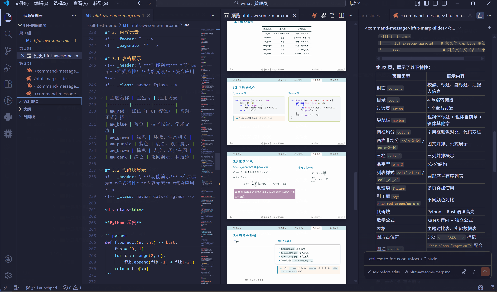<br><b>AI 对话过程</b>｜demo1</td>
    <td align="center">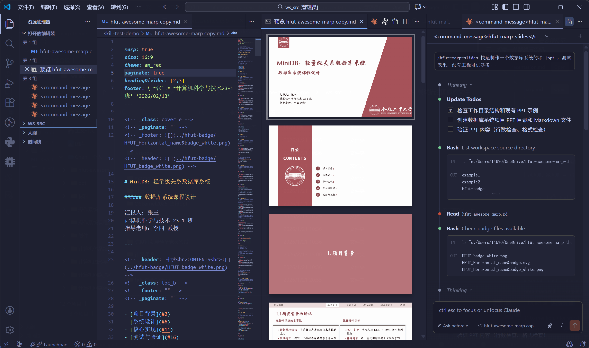<br><b>AI 对话过程</b>｜demo2</td>
  </tr>
</table>

### Skill 规则速览

| 规则                              | 说明                           |
| :-------------------------------- | :----------------------------- |
| 单栏 ≤ 10 行                     | 超出自动拆页                   |
| 两栏每栏 ≤ 8 行                  | 超出自动拆页                   |
| 同一页禁两个表格                  | 几乎必然溢出                   |
| 表格 / 列表用 `ldiv` / `rdiv` | `limg` / `rimg` 会压缩宽度 |
| 图片必须加 `caption` class      | 否则图注样式不渲染             |
| 工程模式禁止编造                  | 所有内容必须有代码依据         |

> 📂 AI 生成的完整示例见 [`ws_src/skill-test-demo/`](./ws_src/skill-test-demo/)：[功能演示](./ws_src/skill-test-demo/demo1-feature.md) ｜ [课设答辩](./ws_src/skill-test-demo/demo2-minidb.md)

## 🤝 贡献

欢迎贡献！如果你发现 Bug 或想丰富主题：

1. **Fork** 本仓库
2. 创建分支 `git checkout -b feature/your-feature`
3. 提交更改 `git commit -m 'feat: Add some feature'`
4. 推送分支 `git push origin feature/your-feature`
5. 发起 **Pull Request**

> 💡 发现问题？请通过 [Issues](https://github.com/cita-777/hfut-awesome-marp-theme/issues) 反馈。

## 📄 许可

本项目基于 [MIT License](./LICENSE) 开源。

## 🙏 鸣谢

- [**Awesome-Marp**](https://github.com/favourhong/Awesome-Marp) — 主题设计的基础和灵感来源
- [**Marp**](https://marp.app/) — 驱动本项目的核心演示文稿引擎
- [**HFUT-badge**](https://github.com/HFUTTUG/HFUT-badge) — SVG 校徽 / 校标资源

---

<div align="center">

**如果这个项目对你有帮助，请给个 ⭐ Star 支持一下！**

Made with ❤️ for HFUTers

</div>
