<!-- _class: cover_e -->
<!-- _paginate: "" -->
<!-- _footer:  -->
<!-- _header:  -->
# 计算机体系结构

###### The Locality Descriptor: A Holistic Cross-Layer Abstraction to Express Data Locality in GPUs
汇报人：Cita
计算机23-0班
<2023217302@mail.hfut.edu.cn>

---

<!-- _header: 目录 CONTENTS -->
<!-- _class: toc_b -->
<!-- _footer: "" -->
<!-- _paginate: "" -->

- [引言](#3)
- [动机](#9)
- [核心方法与设计](#15)
- [实验](#21)
- [总结](#25)

## 1. 引言
<!-- _class: trans -->
<!-- _footer: "" -->
<!-- _paginate: "" -->
## 1. GPU 性能与内存效率
<!-- _header: \ ***计算机体系结构*** **引言** *动机* *核心方法与设计* *实验* *总结*-->
<!-- _class: navbar -->
1. **GPU 的重要性**  
   已成为**高性能计算**和**能效**的关键平台。

2. **内存系统是瓶颈**  
   **高效利用内存资源**对充分发挥 GPU 计算能力至关重要。

3. **数据局部性是关键**  

   | 局部性类型 | 描述 |
   |------------|------|
   | 重用局部性 (reuse-based locality) | 在缓存层次结构中对数据的重复使用。 |
   | NUMA 局部性 (NUMA Locality) | 在非均匀内存访问（NUMA）系统中，将数据放置在靠近使用它的计算单元（如 Streaming Multiprocessor）的位置，以减少远程访问开销。 |

## 2. 软件方面的挑战
<!-- _header: \ ***计算机体系结构*** **引言** *动机* *核心方法与设计* *实验* *总结*-->
<!-- _class: navbar footnote -->

**编程模型无显式局部性接口**
- CUDA、OpenCL 等**没有直接表达数据局部性的方法**。

**专家程序员的技巧**
- 手动优化线程与数据映射关系 (software scheduling)
- 预取/缓存旁路提示 (prefetch/bypass hints)

**软件局限性**
-  **难以直接驱动硬件机制**：软件难以直接影响底层机制，如 CTA 调度策略、缓存旁路或预取行为。
-  **局部性类型多样**：如CTA$^1$间、Warp 间、Warp 内局部性，对菜鸟程序员不友好😢😥😭
- **可移植性差**：基于细粒度 ISA 或特定硬件特性的优化难以跨平台迁移。

1 CTA（Cooperative Thread Array）即 CUDA 中的线程块，thread block

## 3. 硬件方面的挑战
<!-- _header: \ ***计算机体系结构*** **引言** *动机* *核心方法与设计* *实验* *总结*-->
<!-- _class: navbar -->

**硬件透明技术的缺失**
- 现有硬件技术往往无法捕捉到**算法固有的局部性语义**。

**具体技术挑战**
- **CTA 调度**：需要知道哪些 CTA（线程块）共享数据，以便调度到同一 。
- **NUMA 局部性**：需要了解线程访问模式，以便进行数据放置优化。
- **预取/缓存管理**：需要应用的访问模式信息来优化缓存策略。

**核心问题**：硬件难以推断算法的局部性语义，只能靠猜，导致优化效果有限。

## 4. 案例：histo（Parboil）中的数据访问模式
<!-- _header: \ ***计算机体系结构*** **引言** *动机* *核心方法与设计* *实验* *总结*-->
<!-- _class: navbar cols-2 col1_ul_sq fglass -->

- **数据重用现象**：图中颜色相同的 CTA 访问相同数据范围，显示丰富的 CTA 间重用机会。
- **硬件推断困难**：硬件无法知道哪些 CTA 共享数据，难以进行有效调度和数据放置。
- **软件控制局限**：编程模型缺乏局部性接口，程序员难以直接使用硬件优化机制。
- **优化复杂度高**：需要协调 CTA 调度、数据放置等多种技术才能充分利用局部性。

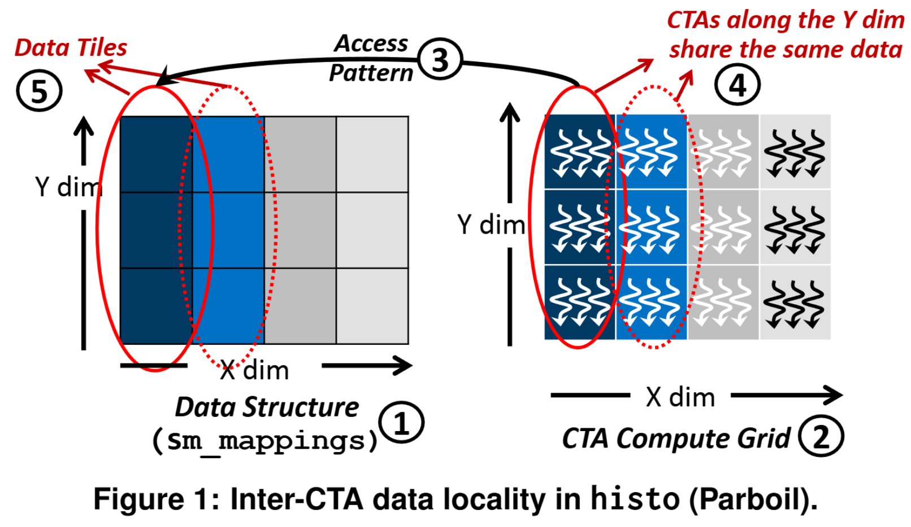

## 5. Locality Descriptor 应运而生
<!-- _header: \ ***计算机体系结构*** **引言** *动机* *核心方法与设计* *实验* *总结*-->
<!-- _class: navbar cols-2-46 col1_ul_sq fglass-->

- **描述符实例**：每个实例描述单个数据结构的局部性特征和地址范围
- **局部性类型契约**：定义线程内（intra-thread）、线程间（inter-thread）等类型，驱动底层优化。
- **数据块划分**：将数据结构划分为块，将数据与访问线程关联，指导 CTA 调度和 NUMA 数据放置。
- **优先级协调**：当多个描述符冲突时，使用软件提供的优先级进行优化协调

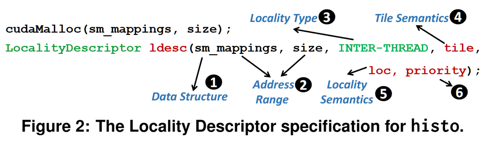

## 2. 动机

<!-- _class: trans -->
<!-- _footer: "" -->
<!-- _paginate: "" -->

## 1. CTA 调度策略对性能和工作集的影响？
<!-- _header: \ ***计算机体系结构*** *引言* **动机** *核心方法与设计* *实验* *总结*-->
<!-- _class: navbar cols-2-64 tinytext-->

**CTA间局部性基础**
- CTA 间局部性：多个 CTA 访问数据的**时间局部性**和**空间局部性**。
- CTA 调度：将共享数据的 CTA 调度到同一 SM，**利用 L1 缓存**。

**实验设计**
- 评估 48 种调度策略（X/Y/Z 维度分组）。
- 指标：最小工作集（每个 SM 平均独特缓存行数）、最大性能提升。

| 应用类型 | 工作集变化 | 性能提升 |
|---------|-----------|---------|
| CTA调度敏感应用 | **↓ 54.5%** | **3.3%** |
| CTA调度不敏感应用 | ↓ 有限 | 潜力大 |

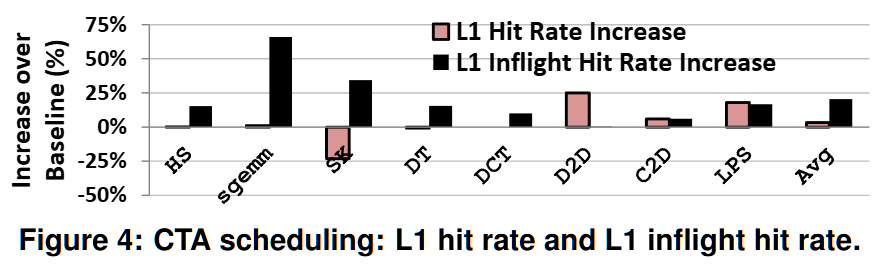

## 2. CTA 调度为何效果有限？
<!-- _header: \ ***计算机体系结构*** *引言* **动机** *核心方法与设计* *实验* *总结*-->
<!-- _class: navbar cols-2 -->

**L1缓存命中率分析**
- **L1 命中率提升有限**（平均 3%），解释性能提升小的原因。
- **L1 缓存中 in-flight 请求的合并率（coalescing rate）显著提升**（平均 20%），表明更多线程同时等待同一数据。

**结论**
- CTA 调度能**有效暴露局部性**（减少工作集），但不足以转化为性能提升。
- 虽然数据复用变多了，但**很多线程扎堆等同一个数据**，反而卡住了，性能提升有限。
- 确定最佳调度策略本身也是一个挑战。

## 3. NUMA 局部性类型
<!-- _header: \ ***计算机体系结构*** *引言* **动机** *核心方法与设计* *实验* *总结*-->
<!-- _class: navbar cols-2 -->

- **背景**：未来 GPU 采用 NUMA 架构，远程访问延迟高、带宽低。
- **目标**：优化数据位置和CTA调度，最大化本地访问

**现有的启发式机制**
- **问题**：调度策略无法处理页面共享，64 KB 页面粒度过大。

| 访问模式 | 结果 | 原因 |
|---------|------|------|
| 同区域CTA共享页面 | 成功 | - |
| 跨区域CTA共享页面 | 失败 | 次优调度 + 大粒度页面 |

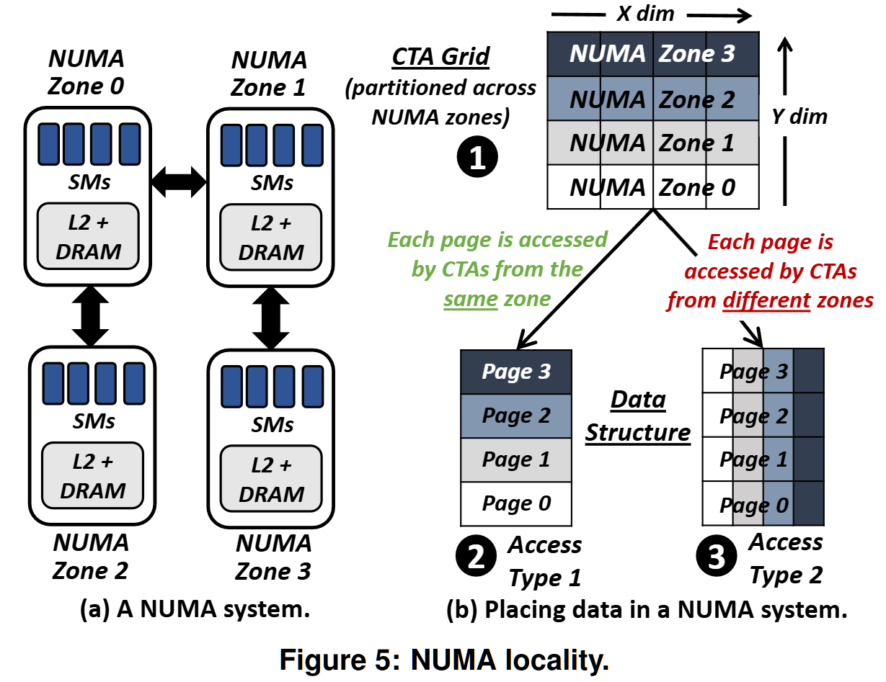

## 4. 其他典型局部性类型
<!-- _header: \ ***计算机体系结构*** *引言* **动机** *核心方法与设计* *实验* *总结*-->
<!-- _class: navbar bq-red -->

| 类型 | 来源 | 特点 | 优化技术 |
|-----|------|-----------|---------|
| **Warp 间局部性** | Stencil 程序，相邻 Warp 访问相邻数据 | 重用距离短，可被 LRU 缓存部分利用 | 跨 Warp 预取、CTA 调度 |
| **线程内局部性** | LIBOR、lavaMD 等私有工作集 | 每个线程有自己的私有数据，但工作集太大，频繁切换 warp 时容易把缓存“冲掉”，导致缓存效率低 | 缓存旁路/优先级、Warp/CTA 限流 |

> 由表容易看出：
>
> **Warp 间**：空间局部性强，适合预取优化。
> **线程内**：时间局部性弱，易受线程切换影响。
> **共同挑战**：需要软硬件协同优化

## 5. 启示与目标
<!-- _header: \ ***计算机体系结构*** *引言* **动机** *核心方法与设计* *实验* *总结*-->
<!-- _class: navbar  cols2_ol_sq fglass tinytext-->

**我们发现什么？**
- GPU 上的**局部性比较复杂**，不同程序表现差异明显。
- 每种局部性**都有自己的难点和挑战**。
- 要解决问题往往**需要软硬件协同**，但软件层面不易直接控制硬件。
- 许多优化**需要了解具体访问模式**，而硬件很难自行精确推断。

**我们想实现什么？**

- 把程序的意图和硬件机制**连接**起来。
- 支持**编译时、运行时、执行时**的多种优化。
- 给程序员**提供简单好用的接口**来表达局部性。
- 让硬件**能利用程序提供的语义信息**来优化性能。

## 3. 核心方法与设计

<!-- _class: trans -->
<!-- _footer: "" -->
<!-- _paginate: "" -->

## 1. 整体框架
<!-- _header: \ ***计算机体系结构*** *引言* *动机* **核心方法与设计** *实验* *总结*-->
<!-- _class: navbar cols-2-73 col1_ol_ci fglass  -->

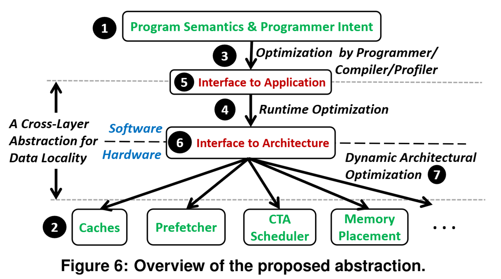

- **程序语义和程序员意图**
- **底层架构机制**
- **静态代码调优**
- **运行时软件优化**
- **编程模型接口**
- **低开销架构接口**
- **动态架构优化**

## 2. LD 设计目标
<!-- _header: \ ***计算机体系结构*** *引言* *动机* **核心方法与设计** *实验* *总结*-->
<!-- _class: navbar pin-3   -->

>1. **补充性与提示性 (Supplemental and Hint-based only)**
>   - 仅作为性能优化的可选附加功能
>   - 不改变程序其他部分，不影响程序正确性

>2. **架构无关性 (Architecture-agnosticism)**
>   - 抽象掉底层架构细节 (如缓存大小、SM 数量、缓存策略)
>   - 提高可移植性，减少编程工作量，便于架构师灵活设计和改进

>3. **通用性与灵活性 (Generality and flexibility)**
>   - 灵活描述 GPU 程序中常见的多种局部性类型
>   - 易于扩展其能表达的内容和受益的底层架构技术

## 3. LD 核心组件
<!-- _header: \ ***计算机体系结构*** *引言* *动机* **核心方法与设计** *实验* *总结*-->
<!-- _class: navbar cols-2-64 col1_ul_sq fglass bq-black  -->

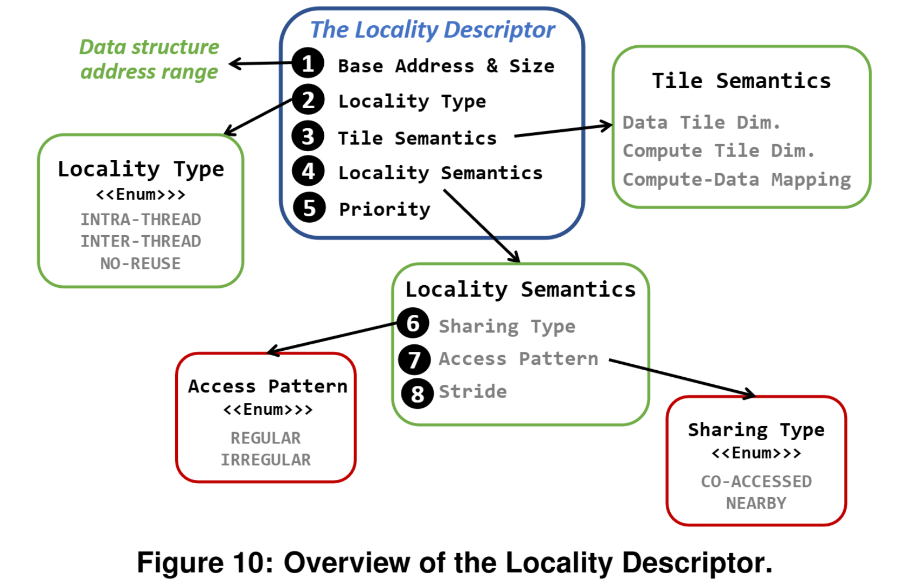

-  **数据结构 (Data Structure)**
-  **局部性类型 (Locality Type)**
-  **块语义 (Tile Semantics)**
-  **局部性语义 (Locality Semantics)**
-  **优先级 (Priority)**

> 核心思想
>
> 围绕程序的**数据结构**及其**访问方式**来描述局部性。

## 4. LD 程序员/编译器接口
<!-- _header: \ ***计算机体系结构*** *引言* *动机* **核心方法与设计** *实验* *总结*-->
<!-- _class: navbar  col1_ul_sq fglass  -->

> **指定时机**：在**数据结构初始化**并**拷贝到全局内存之后**、**内核调用之前**指定 LD。

| 指定方式 | 描述 |
|---------|------|
| **静态分析 (编译器)** | 自动推断局部性，无需程序员干预  |
| **程序员注解 (Annotate)** | 特别适用于手动调优代码，或指定优先级解决冲突。 |
| **软件工具 (Auto-tuners/Profilers)** | 通过动态分析确定局部性和访问模式。 |

## 5. 运行时优化（Runtime）
<!-- _header: \ ***计算机体系结构*** *引言* *动机* **核心方法与设计** *实验* *总结*-->
<!-- _class: navbar  cols-2-64 -->

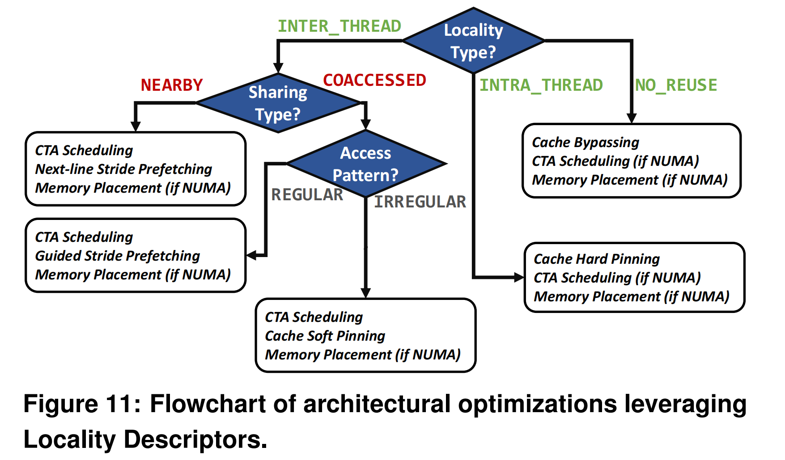

**决策内容（采用的技术集合和协调算法都是后续可扩展的）**:
- CTA 调度策略
- 缓存策略
- 优先级与旁路
- 跨 NUMA 区域的数据放置策略
- 预取策略
> **作用**: GPU 驱动和运行时系统根据底层架构组件的具体情况 (如 SM 数量、NUMA 区域) 决定如何利用 LD 中表达的局部性特征。

## 4. 实验

<!-- _class: trans -->
<!-- _footer: "" -->
<!-- _paginate: "" -->

## 1. 环境
<!-- _header: \ ***计算机体系结构*** *引言* *动机* *核心方法与设计* **实验** *总结*-->
<!-- _class: navbar  col1_ul_sq fglass  -->

> **模拟系统的主要参数**

| 组件 | 参数 |
|------|------|
| 着色器核心 | 1.4 GHz；GTO 调度器[50]；每个 SM 2 个调度器 |
| CTA 调度器 | 轮询 |
| SM 资源 | 寄存器：32768 个；共享内存：48 KB；L1：32 KB，4 路 |
| 内存模型 | FR-FCFS（一种兼顾公平性和访问顺序的 DRAM 调度策略），每通道 16 个 bank |
| 单芯片系统 | 15 个 SM；6 个内存通道；L2：768 KB，16 路 |
| 多芯片系统 | 4 个 GPM（GPU 模块）或 NUMA 区域；64 个 SM（每个模块 16 个）；32 个内存通道；L2：4 MB，16 路；GPM 间互连：192 GB/s；DRAM 带宽：768 GB/s（每个模块 192 GB/s） |

## 2. 评估
<!-- _header: \ ***计算机体系结构*** *引言* *动机* *核心方法与设计* **实验** *总结*-->
<!-- _class: navbar  cols-2 col1_ul_sq fglass  -->

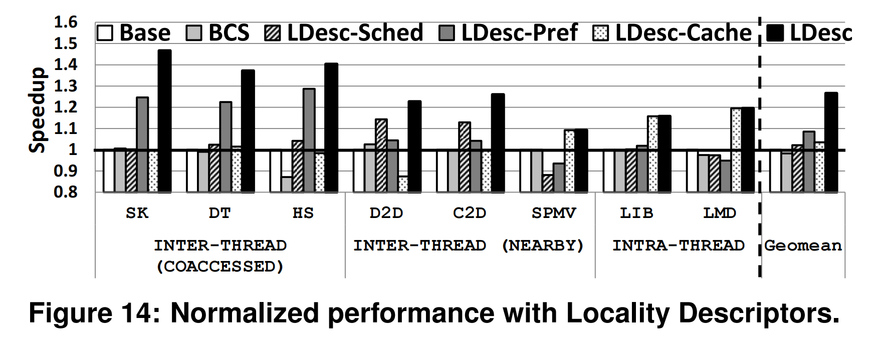
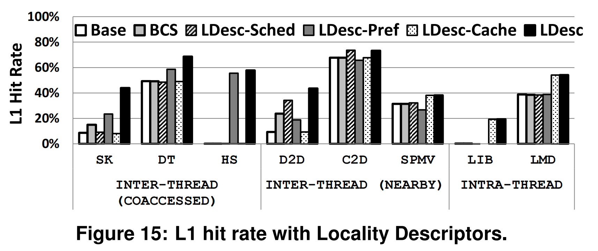

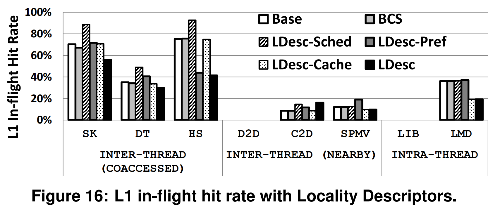
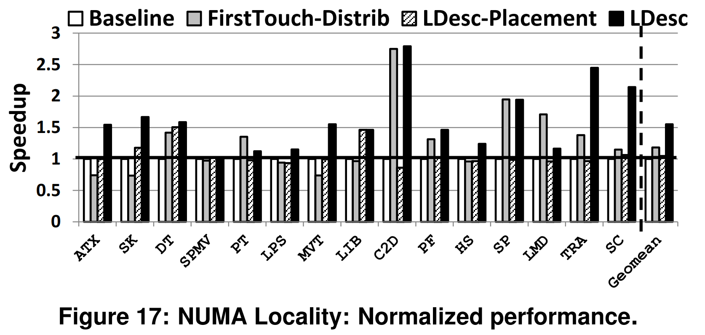

## 3. 评估
<!-- _header: \ ***计算机体系结构*** *引言* *动机* *核心方法与设计* **实验** *总结*-->
<!-- _class: navbar cols-2 col1_ul_sq fglass  -->

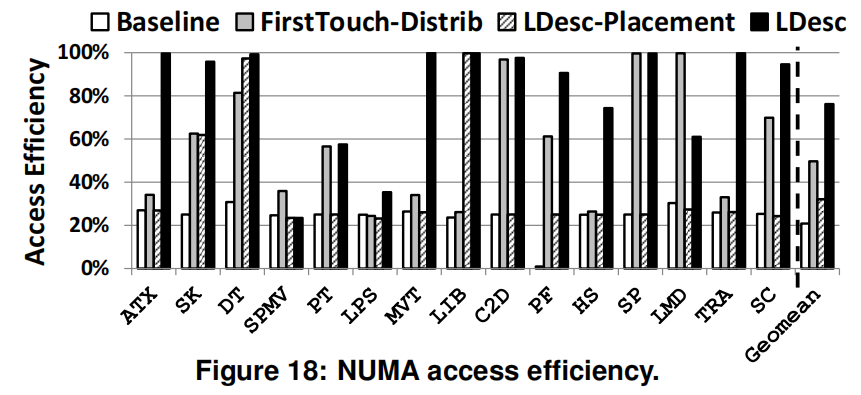

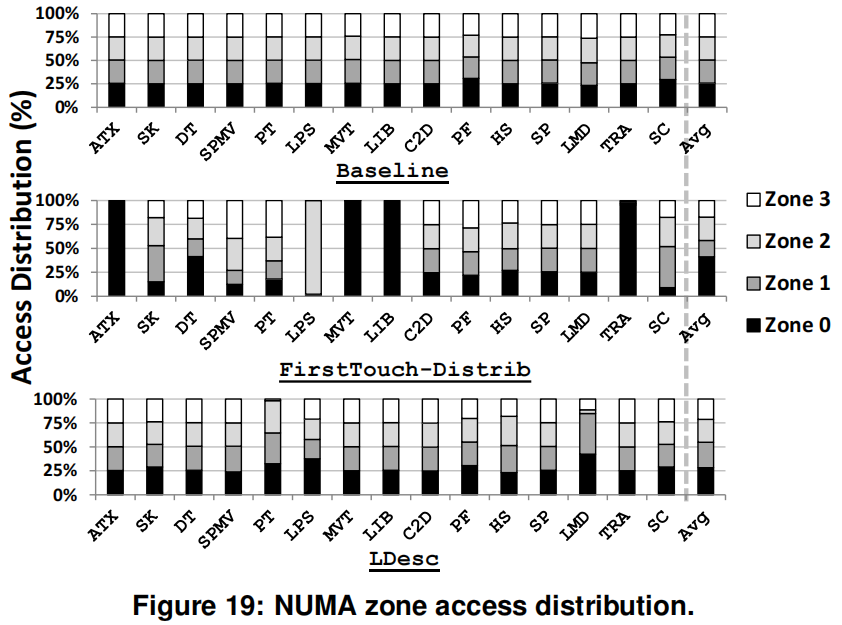

## 5. 总结

<!-- _class: trans -->
<!-- _footer: "" -->
<!-- _paginate: "" -->

## 1. 总结
<!-- _header: \ ***计算机体系结构*** *引言* *动机* *核心方法与设计* *实验* **总结**-->
<!-- _class: navbar  -->

**论文的工作**：首次提出面向 GPU 数据局部性的**跨层抽象**，使软件/程序员能够灵活地表达和利用不同形式的局部性。借助程序语义，可更**透明地协调多种对性能与能效至关重要的架构技术**。

**先前方法的限制**：
- 仅能利用硬件单独推断的信息；
- 现有软件接口限制了可能的优化；
- 可用的优化范围有限。

**局部性描述符（LD）的优势**：为软件/程序员提供了**新的、可移植且灵活的接口**，便于**触达底层硬件技术**以利用数据局部性。多数既有工作与 LD 基本正交，也**可以借助 LD 提供的语义进一步增强效果**。

---

<!-- _class: lastpage  -->
<!-- _footer: ""  -->

###### 感谢观看！ 

  