<!-- _class: cover_e -->
<!-- _paginate: "" -->
<!-- _footer:  -->
<!-- _header:  -->

# OSkernel2025内核设计答辩

###### 2025年操作系统设计赛-华东区域赛


参赛队员：张三、李四、王五
指导老师：A老师、B老师

<style>
.caption {
    text-align: center;
    font-size: 0.75em;
    color: #666;
    margin-top: -5px;
    padding-top: 3px;
}
/* 限制navbar header中logo图片的宽度 */
section.navbar header img {
    max-width: 120px !important;
    height: auto !important;
}
</style>

---

<!-- _header: 目录<br>CONTENTS<br>-->
<!-- _class: toc_b -->
<!-- _footer: "" -->
<!-- _paginate: "" -->

- [项目背景](#3)
- [系统架构设计](#5)
- [核心功能实现](#8)
- [运行演示](#20)
- [总结与展望](#24)


## 1. 项目背景

<!-- _class: trans -->
<!-- _footer: "" -->
<!-- _paginate: "" -->

## 1.1 技术规格与目标
<!-- _header: \ ***OSKernel2025*** **项目背景** *系统架构* *核心功能* *运行演示* *总结*-->
<!-- _class: navbar cols-2 fglass -->

<div class=ldiv>

**技术规格**

| 项目 | 规格 |
|------|------|
| 架构 | x86 (i386) 32 位 |
| 启动方式 | GRUB Multiboot |
| 内存布局 | 高半核映射 (0xC0000000) |
| 页大小 | 4KB |
| 编译器 | GCC `-m32 -ffreestanding` |
| 模拟器 | QEMU（512MB 内存） |

</div>

<div class=rimg>


</div>

## 2. 系统架构设计

<!-- _class: trans -->
<!-- _footer: "" -->
<!-- _paginate: "" -->

## 2.1 整体架构图
<!-- _header: \ ***OSKernel2025*** *项目背景* **系统架构** *核心功能* *运行演示* *总结*-->
<!-- _class: navbar fglass -->


<div class="caption">
图1：OSkernel2025 操作系统整体架构设计图
</div>

## 2.2 项目结构与模块划分
<!-- _header: \ ***OSKernel2025*** *项目背景* **系统架构** *核心功能* *运行演示* *总结*-->
<!-- _class: navbar cols-2-46  fglass -->

<div class=ldiv>

**核心目录结构**

| 目录 | 功能 |
|------|------|
| `boot/` | Multiboot 引导启动 |
| `kernel/` | 内核核心模块 |
| `drivers/` | 设备驱动程序 |
| `fs/` | 文件系统实现 |
| `user/` | 用户空间程序 |
| `lib/` | 内核库函数 |

</div>

<div class=rimg>

<div>

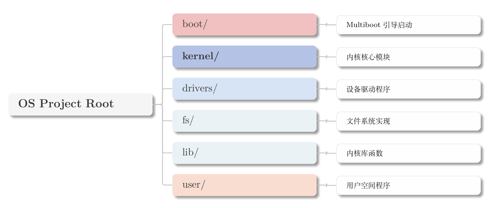

<div class="caption">
图2：项目目录结构示意图
</div>

</div>

</div>

## 3. 核心功能实现

<!-- _class: trans -->
<!-- _footer: "" -->
<!-- _paginate: "" -->

## 3.1 内存管理 - 物理内存
<!-- _header: \ ***OSKernel2025*** *项目背景* *系统架构* **核心功能** *运行演示* *总结*-->
<!-- _class: navbar cols-2 fglass -->

<div class=ldiv>

**物理内存管理器 (PMM)**

- **位图分配器**：使用位图追踪物理页面状态
- **页帧分配**：`pmm_alloc_page()` / `pmm_free_page()`
- 支持 Multiboot 内存映射信息解析


```c
// 位图分配器核心
paddr_t pmm_alloc_page(void) {
    for (size_t i = 0; i < bitmap_size; i++) {
        if (bitmap[i] != 0xFFFFFFFF) {
            int bit = find_first_zero(bitmap[i]);
            bitmap[i] |= (1 << bit);
            return (i * 32 + bit) * PAGE_SIZE;
        }
    }
    return 0;
}
```

</div>

<div class=rimg>

<div>

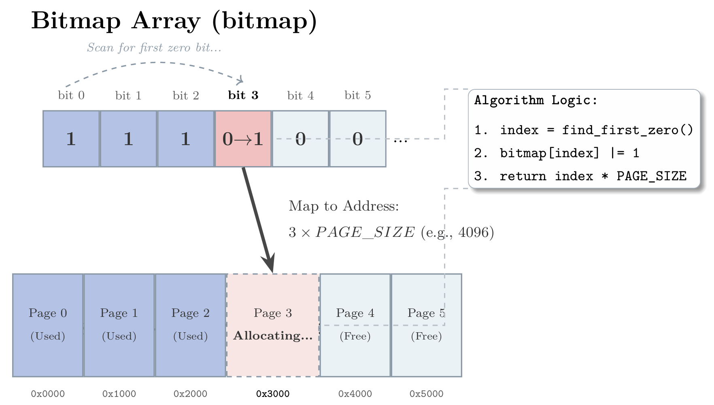

<div class="caption">
图3：物理内存位图分配示意图
</div>

</div>

</div>

## 3.2 内存管理 - 虚拟内存
<!-- _header: \ ***OSKernel2025*** *项目背景* *系统架构* **核心功能** *运行演示* *总结*-->
<!-- _class: navbar cols-2 fglass -->

<div class=ldiv>

**虚拟内存管理器 (VMM)**

| 功能 | 实现 |
|------|------|
| 分页机制 | 二级页表（PD + PT） |
| 高半核映射 | 0xC0000000 |
| 内核堆 | kmalloc/kfree |
| 内存映射 | mmap/munmap |
| 写时复制 | CoW |
| 页面替换 | LRU 算法 |

</div>

<div class=rimg>

<div>

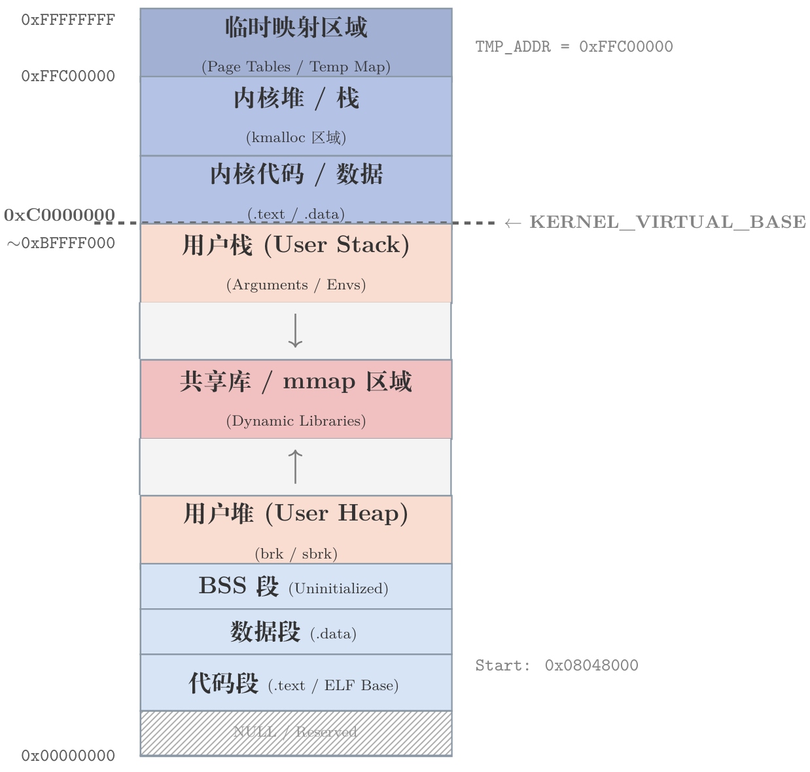

<div class="caption">
图4：虚拟内存地址空间布局
</div>

</div>

</div>

## 3.3 内存管理 - 高级特性
<!-- _header: \ ***OSKernel2025*** *项目背景* *系统架构* **核心功能** *运行演示* *总结*-->
<!-- _class: navbar cols-2-46 fglass bq-red -->

<div class=ldiv>

**写时复制 (Copy-on-Write)**

- fork 时共享父进程页面
- 仅在写入时才复制页面
- 大幅减少内存开销和 fork 延迟

**LRU 页面替换**

- 追踪页面访问时间
- 淘汰最久未使用的页面
- 优化内存利用率

</div>

<div class=rimg>

<div>

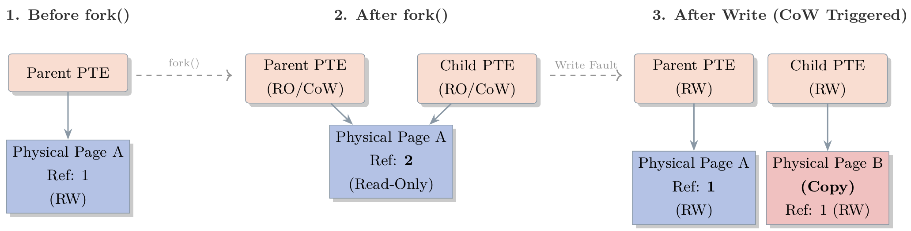

<div class="caption">
图5：写时复制 (CoW) 原理示意图
</div>

</div>

</div>

## 3.4 进程管理
<!-- _header: \ ***OSKernel2025*** *项目背景* *系统架构* **核心功能** *运行演示* *总结*-->
<!-- _class: navbar cols-2 fglass -->

<div class=ldiv>

**进程管理功能**

| 功能 | 系统调用 |
|------|----------|
| 进程创建 | fork, execve |
| 进程等待 | wait, waitpid |
| 进程退出 | exit |
| 进程信息 | getpid, getppid |

**调度算法**

- **时间片轮转**：公平调度所有就绪进程
- **优先级支持**：可设置进程优先级

</div>

<div class=rimg>

<div>

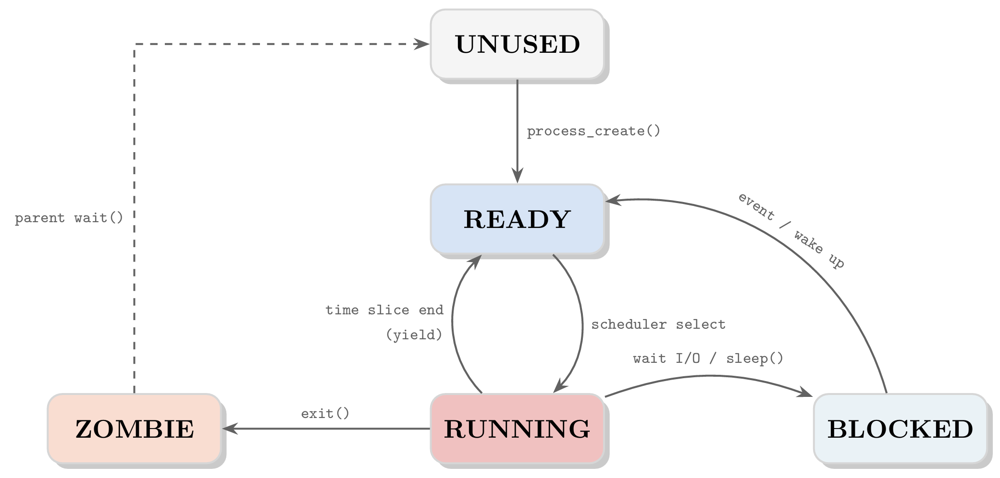

<div class="caption">
图6：进程状态转换图
</div>

</div>

</div>

## 3.5 线程与同步
<!-- _header: \ ***OSKernel2025*** *项目背景* *系统架构* **核心功能** *运行演示* *总结*-->
<!-- _class: navbar cols-2 fglass -->

<div class=ldiv>

**线程支持**

| 特性 | 说明 |
|------|------|
| 内核线程 | 共享进程地址空间 |
| 独立栈空间 | 每个线程拥有独立内核栈 |
| 调度单位 | 线程作为调度基本单位 |

**同步原语**

| 原语 | 用途 |
|------|------|
| 自旋锁 | 短期临界区保护 |
| 互斥锁 | 长期临界区保护 |
| 条件变量 | 线程间条件同步 |
| 读写锁 | 读多写少场景 |

</div>

<div class=rimg>

<div>

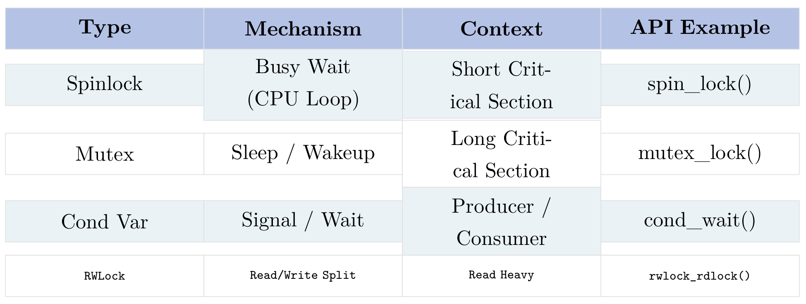

<div class="caption">
图7：同步原语使用场景
</div>

</div>

</div>

## 3.6 进程间通信
<!-- _header: \ ***OSKernel2025*** *项目背景* *系统架构* **核心功能** *运行演示* *总结*-->
<!-- _class: navbar cols-2-46 fglass -->

<div class=limg>

<div style="display: flex; flex-direction: column; align-items: center; width: 100%;">

**IPC 机制一览**

| 机制 | 系统调用 |
|------|----------|
| 管道 | pipe |
| 信号 | signal, kill |
| 消息队列 | msgget, msgsnd, msgrcv |
| 信号量 | semget, semop |
| 共享内存 | shmget, shmat, shmdt |

</div>

</div>

<div class=rimg>

<div>

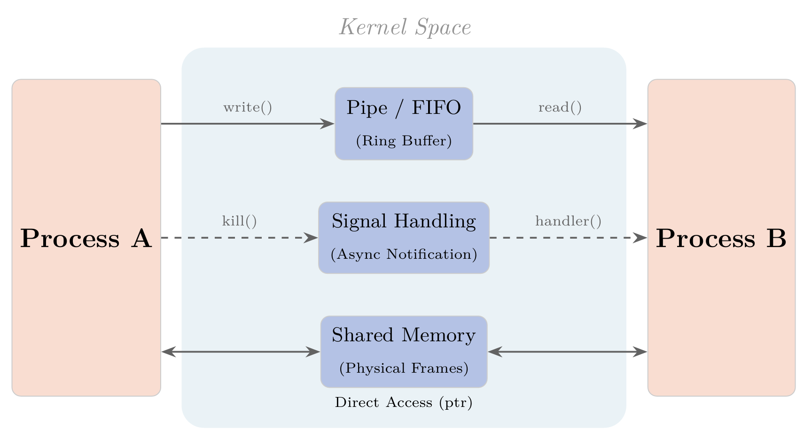

<div class="caption">
图8：进程间通信机制示意图
</div>

</div>

</div>

## 3.7 文件系统
<!-- _header: \ ***OSKernel2025*** *项目背景* *系统架构* **核心功能** *运行演示* *总结*-->
<!-- _class: navbar cols-2 fglass -->

<div class=ldiv>

**VFS 虚拟文件系统**

| 组件 | 功能 |
|------|------|
| vfs.c | 统一文件系统接口 |
| initrd.c | 初始化 RAM 磁盘 |
| ext2.c | ext2 文件系统支持 |
| buffer_cache.c | 块缓存 |
| inode_cache.c | inode 缓存 |

**文件操作**

```c
struct file *vfs_open(const char *path, int flags);
int vfs_read(struct file *f, void *buf, size_t n);
int vfs_write(struct file *f, void *buf, size_t n);
int vfs_close(struct file *f);
```

</div>

<div class=rimg>

<div>

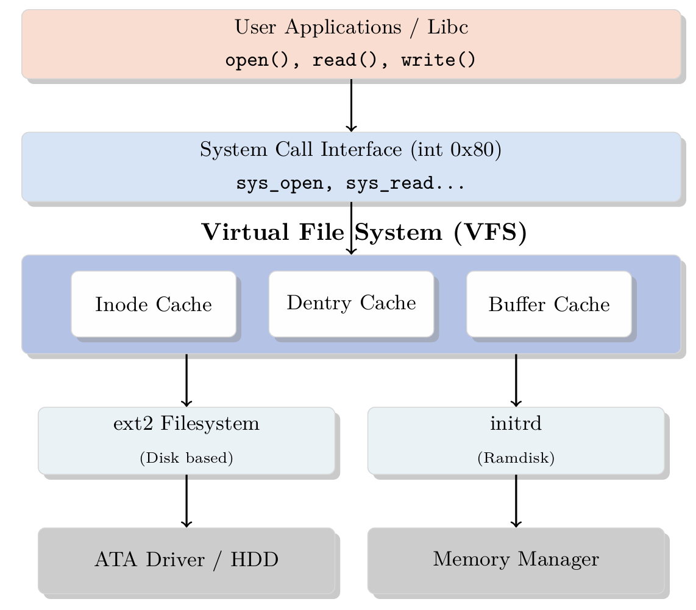

<div class="caption">
图9：VFS 虚拟文件系统架构
</div>

</div>

</div>

## 3.8 设备驱动
<!-- _header: \ ***OSKernel2025*** *项目背景* *系统架构* **核心功能** *运行演示* *总结*-->
<!-- _class: navbar cols-2 fglass -->

<div class=ldiv>

**设备驱动实现**

| 驱动 | 功能 |
|------|------|
| console.c | VGA 文本模式显示 |
| keyboard.c | PS/2 键盘输入 |
| serial.c | 串口调试输出 |
| timer.c | PIT 时钟中断 (100Hz) |
| tty.c | 终端设备抽象 |
| ata.c | IDE 硬盘驱动 |

</div>

<div class=rimg>

<div>

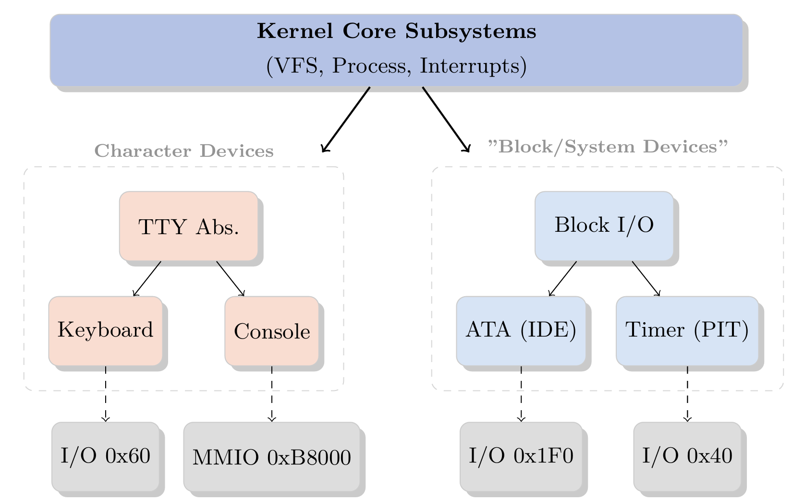

<div class="caption">
图10：设备驱动层次结构
</div>

</div>

</div>

## 3.9 系统调用
<!-- _header: \ ***OSKernel2025*** *项目背景* *系统架构* **核心功能** *运行演示* *总结*-->
<!-- _class: navbar cols-2 fglass -->

<div class=ldiv>

**系统调用接口（int 0x80）**

| 类别 | 系统调用 |
|------|----------|
| 进程 | fork, execve, wait, exit |
| 文件 | open, read, write, close |
| 内存 | mmap, munmap, brk |
| IPC | pipe, signal, kill, msg*, sem*, shm* |

</div>

<div class=rimg>

<div>

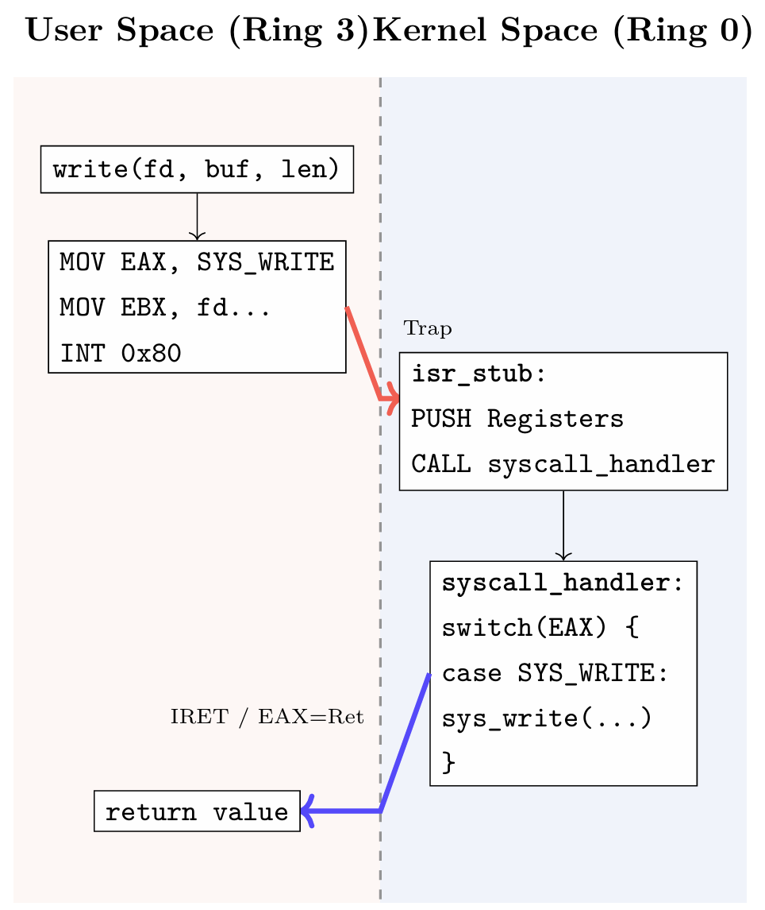

<div class="caption">
图11：系统调用执行流程
</div>

</div>

</div>

## 3.10 用户程序
<!-- _header: \ ***OSKernel2025*** *项目背景* *系统架构* **核心功能** *运行演示* *总结*-->
<!-- _class: navbar cols-2 fglass -->

<div class=ldiv>

**用户空间程序**

| 程序 | 功能 |
|------|------|
| init.c | init 进程（PID 1） |
| shell.c | 交互式 Shell |
| cat/ls/echo | 文件操作命令 |
| ps/uptime | 系统信息命令 |
| shutdown | 关机命令 |

**ELF 加载器**

- 支持标准 ELF32 格式
- 自动设置用户栈和入口点

</div>

<div class=rimg>

<div>

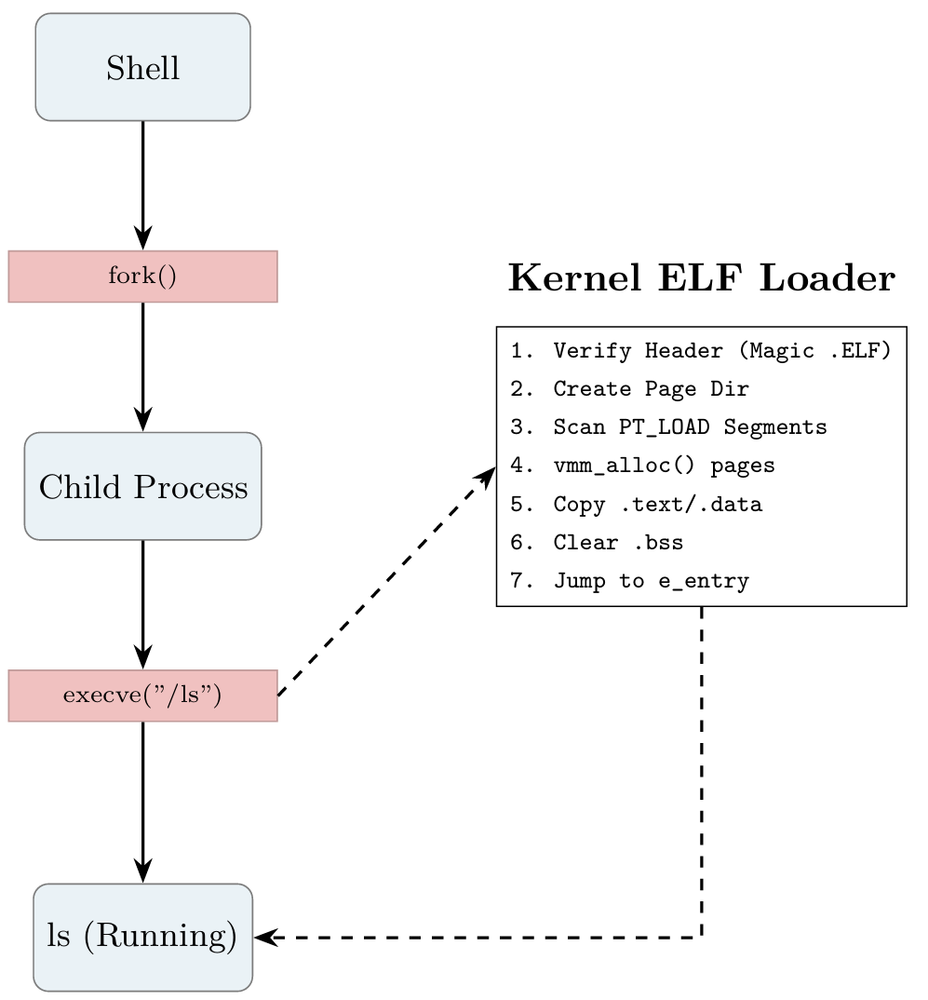

<div class="caption">
图12：用户程序与内核交互
</div>

</div>

</div>

## 4. 运行演示

<!-- _class: trans -->
<!-- _footer: "" -->
<!-- _paginate: "" -->

## 4.1 运行演示
<!-- _header: \ ***OSKernel2025*** *项目背景* *系统架构* *核心功能* **运行演示** *总结*-->
<!-- _class: navbar cols-2 fglass -->


## 5. 总结与展望

<!-- _class: trans -->
<!-- _footer: "" -->
<!-- _paginate: "" -->

## 5.1 项目成果
<!-- _header: \ ***OSKernel2025*** *项目背景* *系统架构* *核心功能* *运行演示* **总结**-->
<!-- _class: navbar cols2_ol_sq fglass -->

- 完整的 x86-32 位内核启动链
- 物理/虚拟内存管理与分页机制
- 进程管理与时间片轮转调度
- 线程支持与同步原语
- 完整的 IPC 机制（管道/信号/消息队列/信号量/共享内存）
- VFS 虚拟文件系统与 ext2 支持
- 写时复制与 LRU 页面替换
- 用户态程序与 ELF 加载


---

<!-- _class: lastpage  -->
<!-- _footer: ""  -->

###### 感谢观看！
