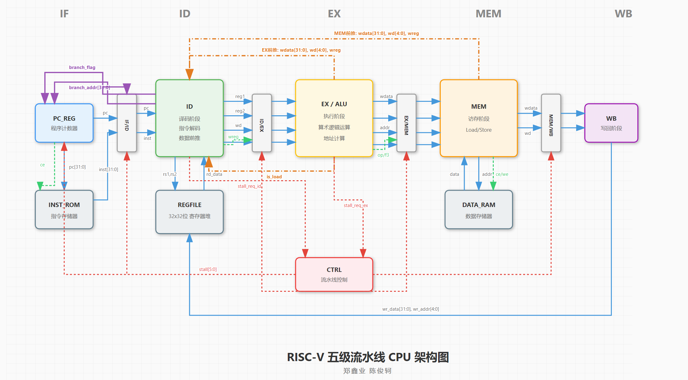
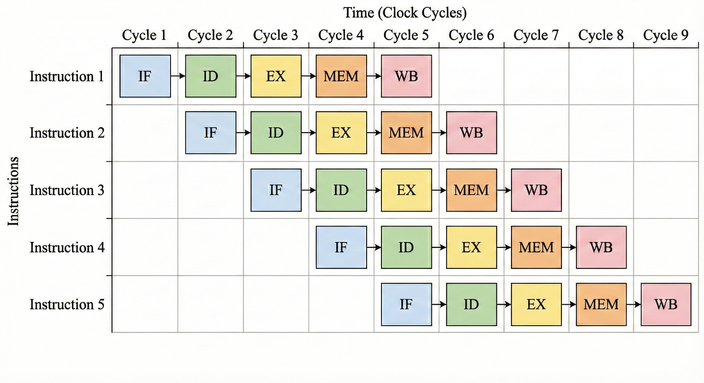
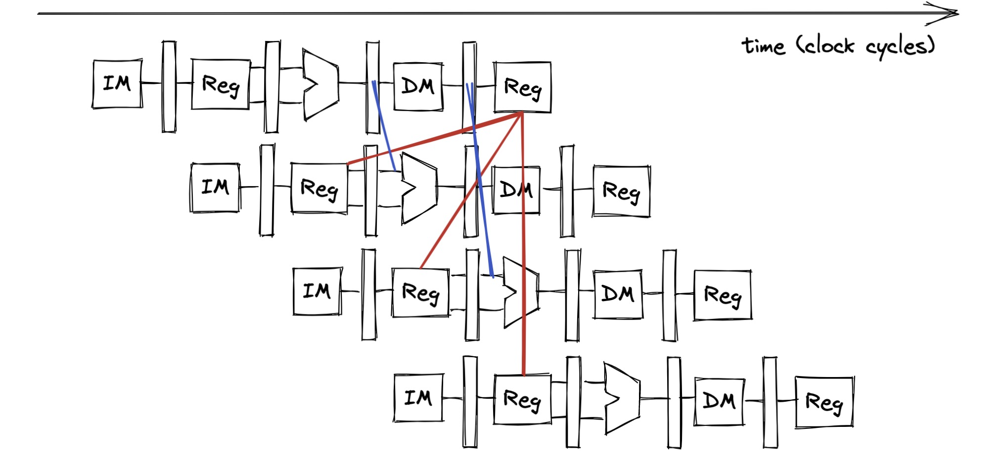
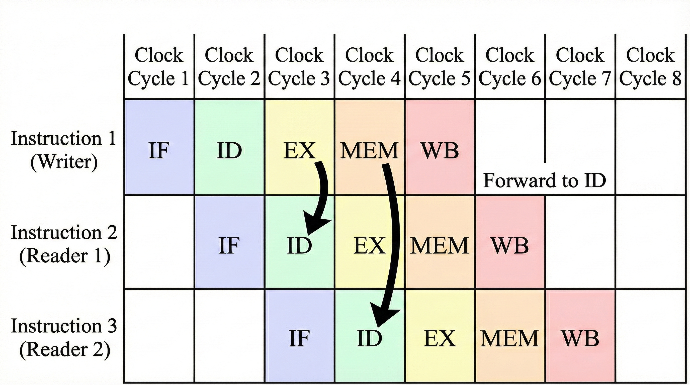
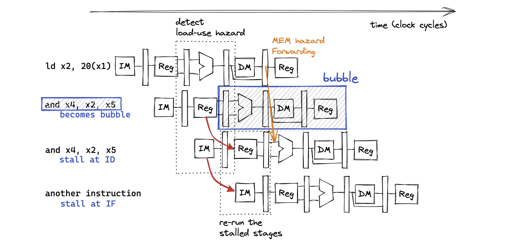
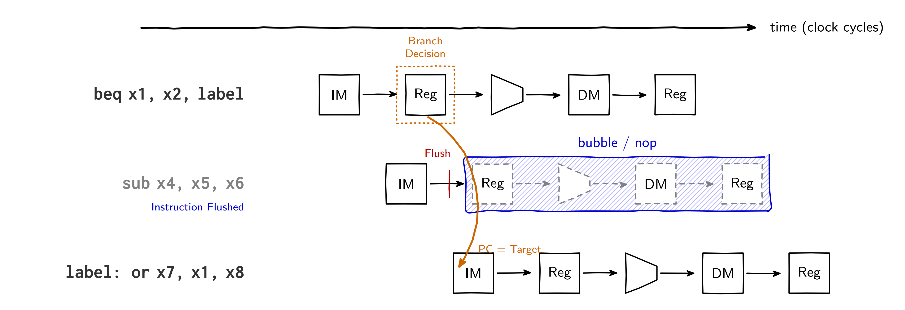
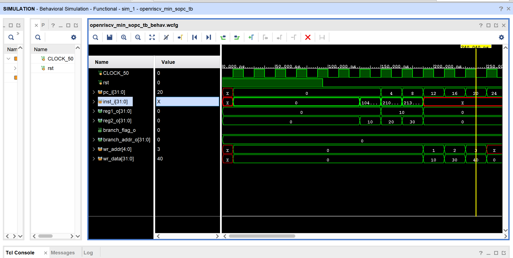
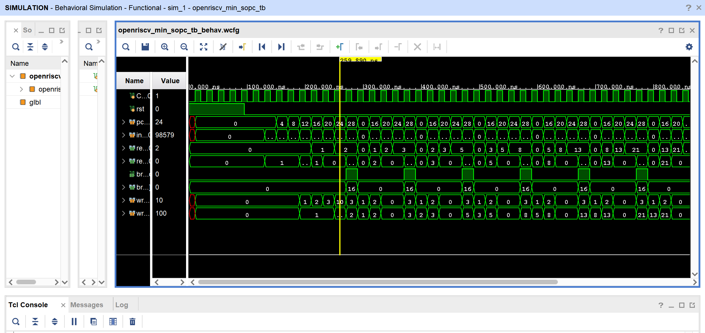
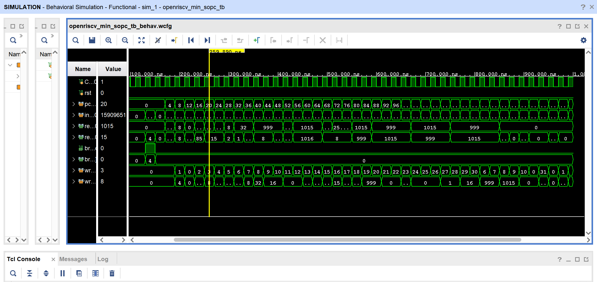
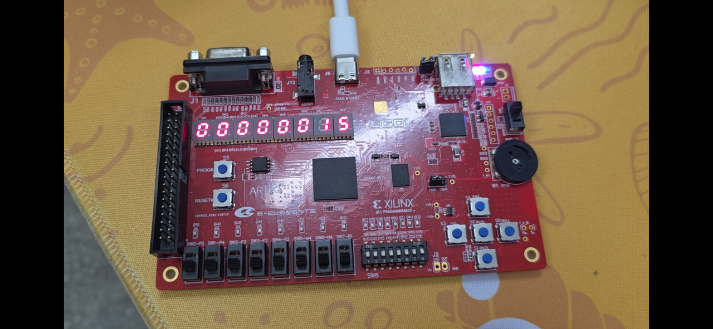

<!-- _class: cover_e -->
<!-- _paginate: "" -->
<!-- _footer:  -->
<!-- _header:  -->

# RISC-V架构的五级流水线处理器

###### 系统硬件综合设计答辩

汇报人：张三、李四
计算机23-1班

<style>
.caption {
    text-align: center;
    font-size: 0.9em;
    margin-top: 5px;
}
</style>

---

<!-- _header: 目录<br>CONTENTS<br>-->
<!-- _class: toc_b -->
<!-- _footer: "" -->
<!-- _paginate: "" -->

- [选题与分工](#3)
- [总体结构设计](#7)
- [性能优化设计](#9)
- [开发工具链](#17)
- [实验验证](#19)


## 1. 选题与分工

<!-- _class: trans -->
<!-- _footer: "" -->
<!-- _paginate: "" -->

## 1.1 选题要求
<!-- _header: \ ***《系统硬件综合设计》申优答辩*** **选题与分工** *总体结构* *性能优化* *工具链* *实验验证* *总结*-->
<!-- _class: navbar fglass bq-red -->

**申优选题：基于精简指令集架构的多周期流水线 CPU 设计**

| 要求项 | 具体内容 | 本设计实现 |
|--------|----------|------------|
| 指令数量 | 不少于 **25 条** | **50 条**（RV32IM_Zbb） |
| 乘除法 | 必须包含乘除法指令 | RV32M 全部 8 条（mul/div 系列） |
| 冒险处理 | 合理解决冒险与冲突 | 数据前推 + 流水线暂停 |
| 性能优化 | 有一定策略并实现 | 前推消除 RAW、分支惩罚 1 周期 |
| FPGA 验证 | 下载至开发板运行测试 | 斐波那契数列数码管显示 |

> **指令集说明**：基于 RV32IM 标准指令集，额外实现 Zbb（位操作扩展）子集中的 5 条常用指令（min/max/andn）

## 1.2 成员分工 - 李四（25条）
<!-- _header: \ ***《系统硬件综合设计》申优答辩*** **选题与分工** *总体结构* *性能优化* *工具链* *实验验证* *总结*-->
<!-- _class: navbar fglass -->

**数据通路与位操作负责人**

| 类别 | 指令 | 条数 |
|------|------|------|
| 访存 Load/Store | lb, lh, lw, lbu, lhu, sb, sh, sw | 8 |
| 乘法 RV32M | mul, mulh, mulhsu, mulhu | 4 |
| 移位操作 | sll, srl, sra, slli, srli, srai | 6 |
| Zbb 位操作 | min, minu, max, maxu, andn | 5 |
| 大立即数 | lui, auipc | 2 |

## 1.2 成员分工 - 张三（25条）
<!-- _header: \ ***《系统硬件综合设计》申优答辩*** **选题与分工** *总体结构* *性能优化* *工具链* *实验验证* *总结*-->
<!-- _class: navbar fglass -->

**控制流与基础算术负责人**

| 类别 | 指令 | 条数 |
|------|------|------|
| 分支/跳转 | beq, bne, blt, bge, bltu, bgeu, jal, jalr | 8 |
| 除法/求余 RV32M | div, divu, rem, remu | 4 |
| 基础算术 | add, sub, addi, and, or, xor, andi, ori, xori, slt, sltu, slti, sltiu | 13 |


## 2. 总体结构设计

<!-- _class: trans -->
<!-- _footer: "" -->
<!-- _paginate: "" -->

## 2.1 CPU 总体结构图
<!-- _header: \ ***《系统硬件综合设计》申优答辩*** *选题与分工* **总体结构** *性能优化* *工具链* *实验验证* *总结*-->
<!-- _class: navbar fglass -->



<div class="caption">
图1：五级流水线 RISC-V CPU 总体结构设计图
</div>

## 3. 性能优化设计

<!-- _class: trans -->
<!-- _footer: "" -->
<!-- _paginate: "" -->


## 3.1 五级流水线架构
<!-- _header: \ ***《系统硬件综合设计》申优答辩*** *选题与分工* *总体结构* **性能优化** *工具链* *实验验证* *总结*-->
<!-- _class: navbar cols-2 -->

<div class=limg>


| 阶段 | 模块 | 功能 |
|------|------|------|
| IF | `pc_reg.v` | 取指令、更新 PC |
| ID | `id.v` + `regfile.v` | 译码、读寄存器 |
| EX | `ex.v` | ALU 运算 |
| MEM | `mem.v` + `data_ram.v` | 访问数据存储器 |
| WB | `regfile.v` | 写回寄存器 |

</div>

<div class=rimg>

<div>



<div class="caption">
图2：五级流水线时序示意图
</div>

</div>

</div>

## 3.2 数据前推机制 - 问题分析
<!-- _header: \ ***《系统硬件综合设计》申优答辩*** *选题与分工* *总体结构* **性能优化** *工具链* *实验验证* *总结*-->
<!-- _class: navbar cols-2 fglass -->

<div class=ldiv>

**问题：数据冒险（RAW Hazard）**

当后续指令需要使用前一条指令的结果时，会发生数据冒险：

```asm
add x1, x2, x3    # 周期5写回 x1
add x4, x1, x5    # 周期3需要读 x1（此时 x1 还未写回！）
```

**传统解决方案：流水线暂停**

- 插入气泡（NOP）等待数据就绪
- 导致 **3 个周期的暂停**
- 严重影响流水线效率

</div>

<div class=rimg>

<div>



<div class="caption">
图3：数据冒险示意图
</div>

</div>

</div>

## 3.2 数据前推机制 - 解决方案
<!-- _header: \ ***《系统硬件综合设计》申优答辩*** *选题与分工* *总体结构* **性能优化** *工具链* *实验验证* *总结*-->
<!-- _class: navbar cols-2 fglass -->

<div class=ldiv>

**解决方案：数据前推（Data Forwarding）**

- **EX→ID 前推**：从执行阶段直接获取结果
- **MEM→ID 前推**：从访存阶段直接获取结果

**实现代码（id.v 第326-331行）**

```verilog
// EX 阶段前推
if ((reg1_read_o == 1'b1) && (ex_wreg_i == 1'b1)
    && (ex_wd_i == reg1_addr_o)) begin
    reg1_o <= ex_wdata_i;  // 直接使用 EX 结果
// MEM 阶段前推  
end else if ((reg1_read_o == 1'b1) && (mem_wreg_i == 1'b1)
    && (mem_wd_i == reg1_addr_o)) begin
    reg1_o <= mem_wdata_i; // 直接使用 MEM 结果
```

</div>

<div class=rimg>

<div>



<div class="caption">
图4：数据前推路径示意图
</div>

</div>

</div>

## 3.3 Load-Use 冒险 - 问题分析
<!-- _header: \ ***《系统硬件综合设计》申优答辩*** *选题与分工* *总体结构* **性能优化** *工具链* *实验验证* *总结*-->
<!-- _class: navbar cols-2 fglass -->

<div class=ldiv>

**问题：Load 指令的特殊性**

Load 指令的数据在 **MEM 阶段**才能获得：

```asm
lw  x1, 0(x2)     # MEM 阶段才能读到数据
add x3, x1, x4    # ID 阶段需要 x1 → 前推无法解决！
```

**为什么前推无法解决？**

| 周期 | lw 指令 | add 指令 |
|------|---------|----------|
| N | EX | ID <- 需要 x1 |
| N+1 | MEM <- x1 就绪 | EX |

x1 在第 N+1 周期才就绪，但 add 在第 N 周期就需要！

</div>

<div class=rimg>

<div>



<div class="caption">
图5：Load-Use 冒险时序分析
</div>

</div>

</div>

## 3.3 Load-Use 冒险 - 解决方案
<!-- _header: \ ***《系统硬件综合设计》申优答辩*** *选题与分工* *总体结构* **性能优化** *工具链* *实验验证* *总结*-->
<!-- _class: navbar cols-2 fglass -->

<div class=ldiv>

**解决方案：流水线暂停 1 周期**

- ID 阶段检测到 Load-Use 依赖 → 发出 `stallreq`
- `ctrl.v` 控制器暂停 IF/ID/EX 阶段
- MEM/WB 阶段继续执行，完成数据加载

**实现代码（id.v 第321-324行）**

```verilog
if (is_load_i == 1'b1 && ex_wd_i == reg1_addr_o
    && reg1_read_o == 1'b1) begin
    stallreq_for_reg1_loadrelate <= `Stop;
    reg1_o <= `ZeroWord;
end
```

**ctrl.v 暂停控制（第31-32行）**：`stall <= 6'b000111`

</div>

<div class=rimg>

<div>


<div class="caption">
图6：Load-Use 暂停机制
</div>

</div>

</div>

## 3.4 分支处理 - 问题分析
<!-- _header: \ ***《系统硬件综合设计》申优答辩*** *选题与分工* *总体结构* **性能优化** *工具链* *实验验证* *总结*-->
<!-- _class: navbar cols-2-46 fglass -->

<div class=ldiv>

**问题：分支带来的控制冒险**

```asm
beq x1, x2, label  # 分支判断
add x3, x4, x5     # 已进入流水线，但可能不该执行
sub x6, x7, x8     # 同上
```

**分支判断时机的影响**

| 判断阶段 | 分支惩罚 | 说明 |
|----------|----------|------|
| MEM | 3 周期 | 传统设计 |
| EX | 2 周期 | 改进设计 |
| **ID** | **1 周期** | **本设计** |

</div>

<div class=rimg>

<div>



<div class="caption">
图7：控制冒险示意图
</div>

</div>

</div>

## 3.4 分支处理 - 解决方案
<!-- _header: \ ***《系统硬件综合设计》申优答辩*** *选题与分工* *总体结构* **性能优化** *工具链* *实验验证* *总结*-->
<!-- _class: navbar cols-2 fglass -->

<div class=ldiv>

**解决方案：ID 阶段判断 + 流水线冲刷**

- 分支在 **ID 阶段**计算完成（id.v 第155-218行）
- 若分支发生 → `branch_flag` 有效
- `if_id` 寄存器将后续指令替换为 **NOP**

**实现代码（if_id.v 第33-35行）**

```verilog
// 发生分支时，使用空指令冲刷流水线
end else if (branch_flag_i == `BranchEnable) begin
    id_pc <= `ZeroWord;
    id_inst <= `ZeroWord;  // 插入 NOP
end
```

**优势**：分支惩罚仅 **1 个周期**

</div>

<div class=rimg>

<div>


<div class="caption">
图8：分支冲刷机制
</div>

</div>

</div>

## 4. 开发工具链

<!-- _class: trans -->
<!-- _footer: "" -->
<!-- _paginate: "" -->

## 4.1 汇编编译工具链
<!-- _header: \ ***《系统硬件综合设计》申优答辩*** *选题与分工* *总体结构* *性能优化* **工具链** *实验验证* *总结*-->
<!-- _class: navbar cols-2 fglass -->

<div class=ldiv>

**自制工具链（tools/目录）**

将 RISC-V 汇编代码编译为 Verilog 可加载格式：

| 文件 | 功能 |
|------|------|
| `Makefile` | 自动化编译脚本 |
| `ram.ld` | 链接脚本，定义内存布局 |
| `fibonacci.s` | 斐波那契测试程序 |

**编译流程**

```bash
make              # 编译 fibonacci.s
make SRC=xxx.s    # 编译指定汇编文件
make install      # 复制到 Verilog 项目目录
make dump         # 反汇编查看机器码
```

</div>

<div class=rdiv>

**Makefile 核心逻辑**

```makefile
# 工具链配置
CROSS_COMPILE = riscv64-unknown-elf-
ARCH = -march=rv32i -mabi=ilp32

# 编译流程
$(TARGET).om: $(SRC) $(LDSCRIPT)
    $(CC) $(ARCH) -nostdlib -T $(LDSCRIPT) \
        $(SRC) -o $@

# 生成十六进制（小端序）
$(TARGET).data: $(TARGET).bin
    hexdump -v -e '4/1 "%02x" "\n"' $< > $@
```

</div>

## 5. 实验验证

<!-- _class: trans -->
<!-- _footer: "" -->
<!-- _paginate: "" -->

## 5.1 指令集覆盖测试
<!-- _header: \ ***《系统硬件综合设计》申优答辩*** *选题与分工* *总体结构* *性能优化* *工具链* **实验验证** *总结*-->
<!-- _class: navbar tinytext -->

**测试方法**：编写覆盖全部 50 条指令的测试程序（inst_rom.txt），每条指令后标注预期写回值

| 指令类别 | 指令列表 | 测试结果 |
|----------|----------|----------|
| **算术逻辑（19条）** | addi, ori, xori, andi, slli, srli, srai, slti, sltiu, add, sub, or, xor, and, sll, srl, sra, slt, sltu | 全部通过 |
| **大立即数（2条）** | lui, auipc | 全部通过 |
| **访存（8条）** | lw, lb, lbu, lh, lhu, sw, sb, sh | 全部通过 |
| **控制流（8条）** | jal, jalr, beq, bne, blt, bge, bltu, bgeu | 全部通过 |
| **RV32M（8条）** | mul, mulh, mulhsu, mulhu, div, divu, rem, remu | 全部通过 |
| **Zbb（5条）** | min, minu, max, maxu, andn | 全部通过 |

## 5.2 数据前推效果验证
<!-- _header: \ ***《系统硬件综合设计》申优答辩*** *选题与分工* *总体结构* *性能优化* *工具链* **实验验证** *总结*-->
<!-- _class: navbar cols-2 -->

<div class=ldiv>

**测试场景：连续数据依赖**

```asm
addi x1, x0, 10    # x1 = 10
addi x2, x1, 20    # x2 = x1 + 20 = 30
add  x3, x1, x2    # x3 = x1 + x2 = 40
```

**对比结果**

| 指标 | 无前推 | 有前推 |
|------|--------|--------|
| 暂停周期 | 4 周期 | **0 周期** |
| 执行总周期 | 11 周期 | **7 周期** |
| 性能提升 | - | **36%** |

**结论**：数据前推有效消除了 RAW 冒险导致的流水线暂停

</div>

<div class=rimg>

<div>



<div class="caption">
图9：数据前推效果仿真波形对比
</div>

</div>

</div>

## 5.3 仿真波形验证
<!-- _header: \ ***《系统硬件综合设计》申优答辩*** *选题与分工* *总体结构* *性能优化* *工具链* **实验验证** *总结*-->
<!-- _class: navbar cols-2 -->

<div class=limg>

<div>



<div class="caption">
图10：斐波那契数列仿真波形
</div>

</div>

</div>

<div class=rimg>

<div>



<div class="caption">
图11：指令集测试仿真波形
</div>

</div>

</div>

## 5.4 FPGA 上板调试 - ILA 逻辑分析仪
<!-- _header: \ ***《系统硬件综合设计》申优答辩*** *选题与分工* *总体结构* *性能优化* *工具链* **实验验证** *总结*-->
<!-- _class: navbar cols-2 fglass -->

<div class=ldiv>

**遇到的问题**

上板初期数码管显示不正确，仿真无法定位实际硬件问题

**解决方案：使用 Vivado ILA IP 核**

在 `debug.xdc` 中配置逻辑分析仪：

```tcl
# 创建 ILA 核心
create_debug_core u_ila_0 ila
set_property C_DATA_DEPTH 1024 [get_debug_cores u_ila_0]

# 连接探针到 display_reg1 信号
connect_debug_port u_ila_0/probe0 [get_nets 
  {openriscv0/display_buffer0/display_reg1[0]} 
  ... 
  {openriscv0/display_buffer0/display_reg1[31]}]
```

</div>

<div class=rdiv>

**监测的信号（regfile.v L54-56）**

```verilog
// 当写入 x3 寄存器时，输出到显示
if (wr_addr == 5'b00011) begin
    reg3_o <= wr_data;
end
```

**ILA 配置参数**

| 参数 | 配置值 |
|------|--------|
| 采样深度 | 1024 |
| 探针宽度 | 32 位 |
| 监测信号 | `display_reg1[31:0]` |
| 触发条件 | DATA_AND_TRIGGER |

</div>

## 5.5 FPGA 上板验证 - 运行效果
<!-- _header: \ ***《系统硬件综合设计》申优答辩*** *选题与分工* *总体结构* *性能优化* *工具链* **实验验证** *总结*-->
<!-- _class: navbar cols-2 -->

<div class=ldiv>

**测试程序：斐波那契数列（fibonacci.s）**

```asm
_start:
    addi x1, x0, 1      # x1 = 1 (F1)
    addi x2, x0, 1      # x2 = 1 (F2)
    addi x10, x0, 100   # x10 = 100 (终止条件)
loop:
    add  x3, x1, x2     # x3 = x1 + x2
    addi x1, x2, 0      # x1 = x2
    addi x2, x3, 0      # x2 = x3
    bltu x3, x10, loop  # 如果 x3 < 100，跳转
```

**输出序列**：1, 1, 2, 3, 5, 8, 13, 21, 34, 55, 89

**开发板**：EGO1（Xilinx Artix-7）

</div>

<div class=rimg>

<div>



<div class="caption">
图12：EGO 开发板运行效果（数码管显示斐波那契数列）
</div>

</div>

</div>

---

<!-- _class: lastpage  -->
<!-- _footer: ""  -->

###### 感谢观看！


